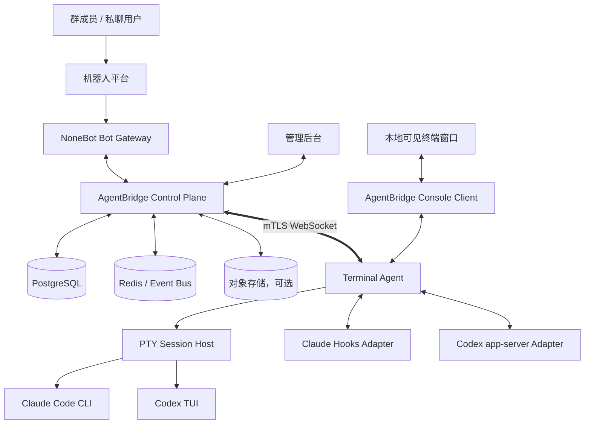
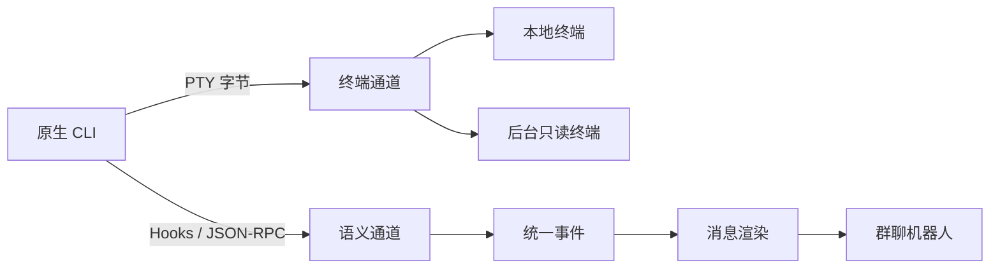
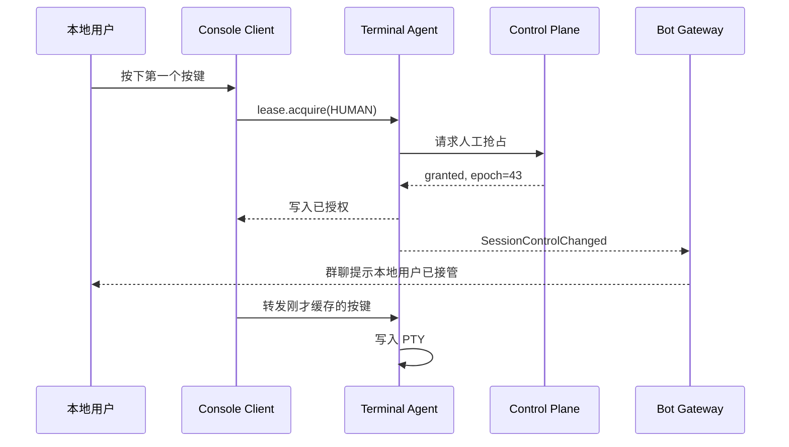
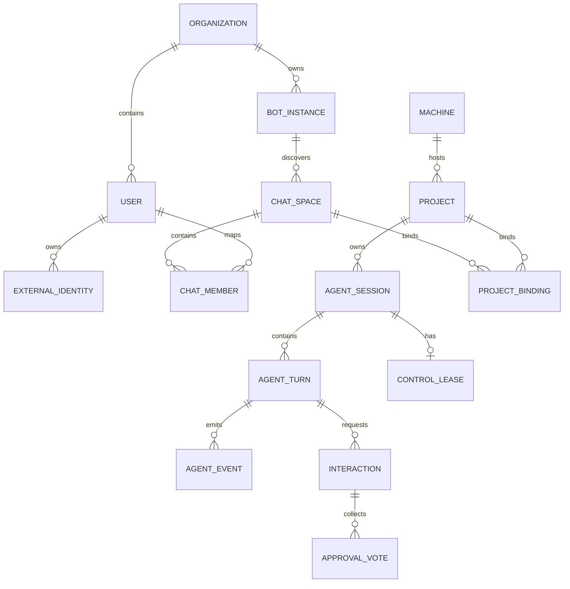
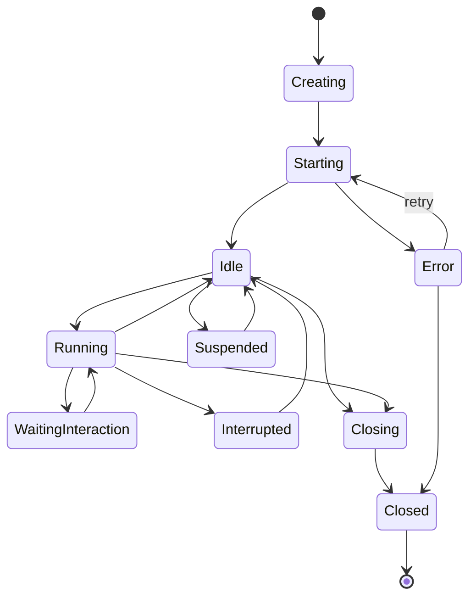
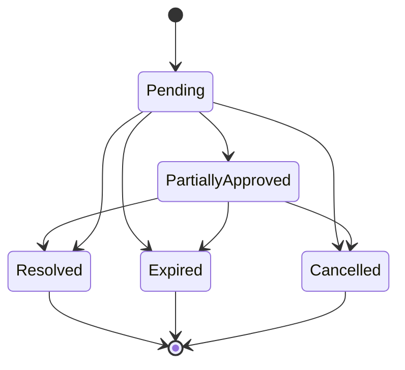
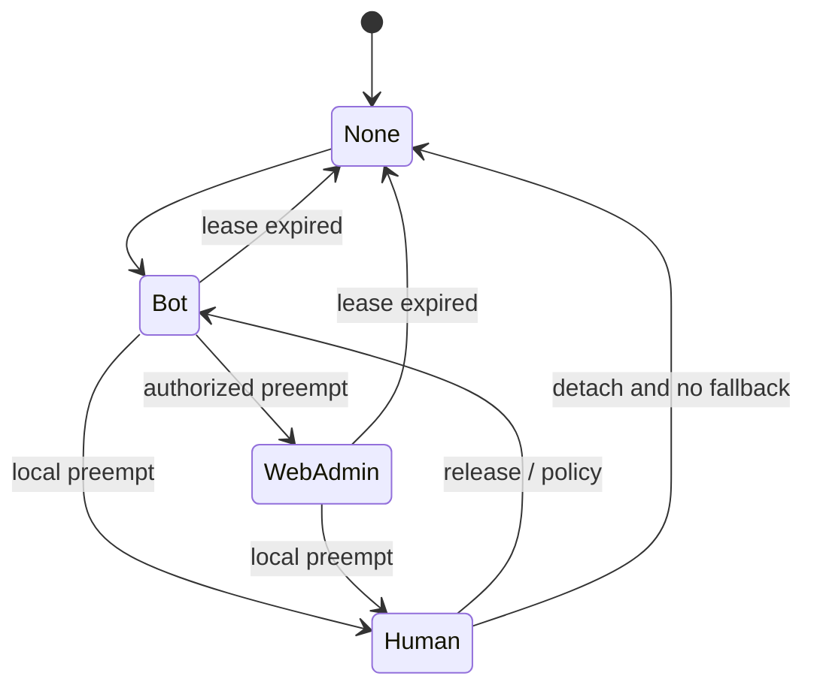
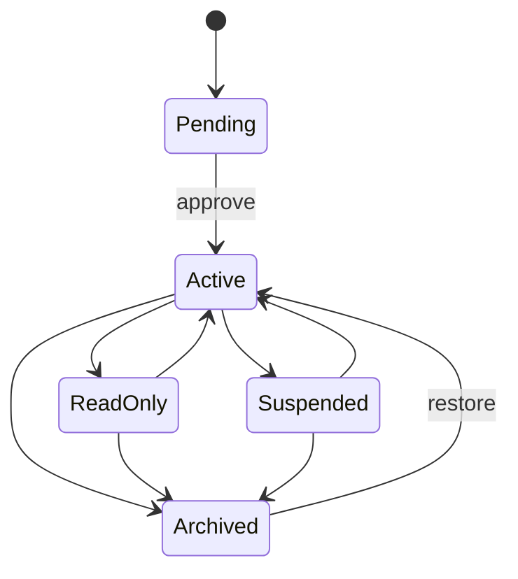
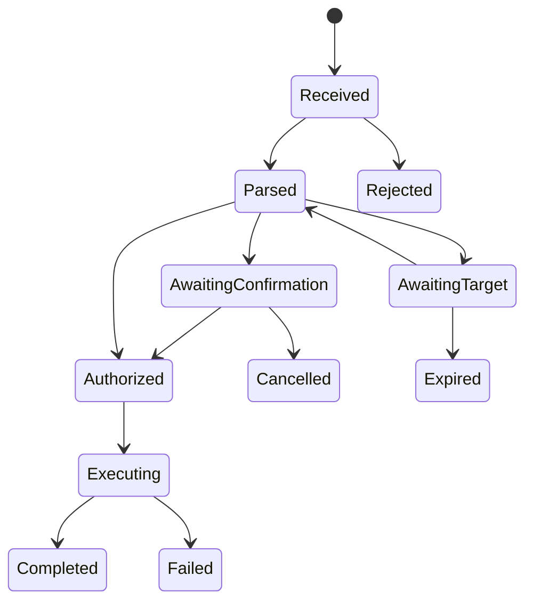

# AgentBridge 项目总设计文档

> 面向群聊机器人的本地编程 Agent 远程协作平台

| 项目 | 内容 |
|---|---|
| 文档状态 | 架构与产品设计草案 v0.2 |
| 暂定项目名 | AgentBridge |
| 文档日期 | 2026-06-25 |
| 本次修订 | 补充多项目管理、多会话管理、Slash（`/`）指令系统及其权限、API、后台和验收设计 |
| 目标读者 | 产品负责人、架构师、后端/前端/机器人/终端工程师、安全与运维人员 |
| 首要支持 | Claude Code、Codex、NoneBot、OneBot、Telegram、Discord、飞书 |
| 核心定位 | 让群聊成员在受控权限下远程协作本机原生 CLI，同时允许人类在电脑前无缝接管同一个终端会话 |

---

## 目录

1. [项目摘要](#1-项目摘要)
2. [背景与问题](#2-背景与问题)
3. [产品目标与非目标](#3-产品目标与非目标)
4. [设计原则](#4-设计原则)
5. [用户角色与典型场景](#5-用户角色与典型场景)
6. [术语](#6-术语)
7. [总体架构](#7-总体架构)
8. [核心组件职责](#8-核心组件职责)
9. [多项目管理](#9-多项目管理)
10. [多会话管理](#10-多会话管理)
11. [会话、控制权与人工接管](#11-会话控制权与人工接管)
12. [终端系统设计](#12-终端系统设计)
13. [Agent 适配器](#13-agent-适配器)
14. [机器人接入与多协议适配](#14-机器人接入与多协议适配)
15. [Slash（`/`）指令与交互命令系统](#15-slash-指令与交互命令系统)
16. [统一消息渲染系统](#16-统一消息渲染系统)
17. [问题、计划与审批交互](#17-问题计划与审批交互)
18. [群聊权限模型](#18-群聊权限模型)
19. [后台管理系统](#19-后台管理系统)
20. [领域模型与数据设计](#20-领域模型与数据设计)
21. [统一事件协议](#21-统一事件协议)
22. [服务接口设计](#22-服务接口设计)
23. [状态机](#23-状态机)
24. [安全设计与威胁模型](#24-安全设计与威胁模型)
25. [部署架构](#25-部署架构)
26. [配置设计](#26-配置设计)
27. [可观测性与审计](#27-可观测性与审计)
28. [可靠性与故障恢复](#28-可靠性与故障恢复)
29. [测试策略](#29-测试策略)
30. [性能目标与服务指标](#30-性能目标与服务指标)
31. [技术栈建议](#31-技术栈建议)
32. [仓库结构](#32-仓库结构)
33. [版本路线图](#33-版本路线图)
34. [MVP 验收标准](#34-mvp-验收标准)
35. [关键架构决策](#35-关键架构决策)
36. [待确认问题](#36-待确认问题)
37. [参考资料](#37-参考资料)

---

## 1. 项目摘要

AgentBridge 是一个**专为机器人和群聊场景设计的本地编程 Agent 控制平台**。它将 Claude Code、Codex 等原生 CLI 保持在用户电脑上的可见终端中运行，同时将 Agent 的回答、工具调用、文件变更、问题确认和权限审批转换为结构化事件，经由 NoneBot 等机器人框架投递到 QQ、Telegram、Discord、飞书等平台。

项目不把机器人视为 CLI 的唯一主人，而把机器人、本地用户和管理后台视为同一个会话的不同客户端：

- 机器人可在群聊中发起任务、查看进度、回答问题和执行审批；
- 本地用户可随时回到电脑，通过已经打开的终端窗口取得控制权；
- 人类接管时不会启动新会话，不丢失上下文，不重新登录，也不迁移工作目录；
- 管理员可在后台管理群组、用户、多项目、Workspace、多会话、命令、权限、审批规则和审计记录；
- 每一个写入者都受“单写者租约”约束，避免机器人与人类同时向原生 CLI 输入导致状态损坏。

项目的关键创新不是简单地把终端输出转发到聊天软件，而是同时维护两条通道：

1. **终端通道**：传递原始 PTY 字节、按键、窗口尺寸与信号，保证原生 CLI 和人工接管体验；
2. **语义通道**：传递回答文本、工具事件、Diff、问题、计划、审批与完成状态，保证机器人侧能够可靠渲染和交互。

```text
终端通道负责“像真实终端一样工作”
语义通道负责“像成熟机器人产品一样交互”
```

---

## 2. 背景与问题

### 2.1 当前方案的常见缺陷

现有远程控制编程 Agent 的方案通常落入以下几类：

- 使用 `claude -p`、`codex exec` 等一次性非交互命令；
- 通过 SDK 重新实现一个聊天客户端，与用户本地 CLI 会话彼此独立；
- 仅抓取 PTY 或 tmux 屏幕，依靠 ANSI 清理和正则猜测回答内容；
- 只适配 Telegram 或 Discord，缺乏 NoneBot 和国内机器人协议；
- 仅实现消息收发，不支持工具审批、问题选项、计划确认和 Diff；
- 缺乏群聊成员身份、角色、风险等级、审批人和多人确认机制；
- 机器人进程退出后，CLI 会话也随之结束；
- 人回到电脑后无法安全地接管同一个终端，只能新开会话或与机器人抢输入。

### 2.2 项目要解决的核心问题

AgentBridge 需要同时解决以下问题：

1. **原生性**：Agent 必须运行在原生交互式 CLI，而不是一次性打印模式；
2. **可见性**：电脑上必须存在可观察的真实终端窗口；
3. **可接管性**：人类回到电脑后，可接管同一个进程和同一个上下文；
4. **机器人友好**：回答、工具、问题、审批、文件和 Diff 必须适配聊天平台；
5. **多协议**：通过 NoneBot 及扩展适配器支持多种机器人协议；
6. **群聊安全**：不同群、项目、成员和风险等级必须具备细粒度权限；
7. **可运营性**：提供后台、审计、限流、告警、会话管理和故障恢复；
8. **多项目与多会话**：群聊可确定性地选择项目、并行管理多个长期会话；
9. **指令化控制**：通过统一 `/agent` 指令、原生 Slash Command 和交互回调管理全部资源；
10. **可扩展性**：未来可加入 Gemini CLI、OpenCode、Qwen Code 等其他 Agent。

---

## 3. 产品目标与非目标

### 3.1 产品目标

#### G1：原生 CLI 长会话

- 支持长期运行的 Claude Code 和 Codex 交互会话；
- 支持恢复、停止、重启、派生和归档会话；
- 不要求每轮重新启动 CLI；
- 会话与机器人连接解耦。

#### G2：可见终端与人工无缝接管

- 启动会话时可自动打开本机终端窗口；
- 终端窗口可长期显示原生 TUI；
- 本地用户首次输入前自动申请人工控制权；
- 人工控制期间机器人降级为观察者；
- 人工释放控制后机器人可继续工作。

#### G3：机器人优先的交互体验

- 流式回答；
- 工具调用进度；
- 命令输出摘要；
- 文件修改和 Diff；
- 单选、多选、自由文本问题；
- 普通审批、高危审批和多人审批；
- 按钮、选择器、引用回复和纯文本降级。

#### G4：多平台机器人接入

首批支持：

- OneBot V11 / V12；
- QQ 官方机器人；
- Telegram；
- Discord；
- 飞书；
- 后续支持钉钉、KOOK、Satori、Milky、微信公众号等。

#### G5：群组与企业级管理能力

- 群组绑定项目；
- 角色与权限；
- 项目目录白名单；
- 风险规则；
- 限流与并发限制；
- 审批人和审批人数；
- 审计日志；
- 管理后台。

### 3.2 非目标

首期不追求：

- 替代 Claude Code 或 Codex 自身的模型、工具和上下文系统；
- 从 PTY 画面中推断完整语义；
- 通过机器人暴露任意系统 Shell；
- 允许多个写入者同时操作同一 CLI；
- 把终端原始字节直接发送到普通群聊；
- 默认跳过所有 Agent 权限检查；
- 首期支持所有操作系统、终端模拟器和机器人协议；
- 首期实现跨组织 SaaS 计费和公开托管市场。

---

## 4. 设计原则

### 4.1 单一会话，多种控制面

同一个 Agent 会话可以被机器人、Web 后台和本地终端观察，但同一时刻只能有一个写入者。

### 4.2 语义事件优先，终端解析兜底

回答、工具、文件、问题和审批应优先来自 Claude Hooks、Codex app-server 等结构化来源。PTY 主要用于原生终端兼容、人工观察和按键输入。

### 4.3 人类本地控制优先

本地用户可以抢占机器人控制权；机器人不能静默抢占本地用户。高风险操作不能因为本地窗口无人操作而自动放行。

### 4.4 权限与模型输出分离

模型提出的命令、理由和风险描述均不构成授权。授权由 AgentBridge 自身的身份、策略和审批系统决定。

### 4.5 平台能力协商与可靠降级

每个机器人协议能力不同。任何按钮、卡片、编辑消息或线程能力都必须有纯文本替代路径。

### 4.6 默认最小权限

默认只允许读取已绑定项目，写入、执行、网络访问、部署和删除操作按策略逐级提升权限。

### 4.7 可恢复而非假定永不失败

机器人断线、控制面重启、Agent 崩溃、WebSocket 重连、审批超时和平台限流都应有明确恢复路径。

---

## 5. 用户角色与典型场景

### 5.1 用户角色

| 角色 | 说明 |
|---|---|
| 群成员 | 查看状态或提出普通任务 |
| 操作者 | 可向绑定项目的会话发送任务 |
| 问题回答者 | 可回答 Agent 的业务问题 |
| 审批人 | 可批准普通工具和文件修改 |
| 高危审批人 | 可批准部署、删除、数据库、发布等高风险操作 |
| 项目维护者 | 可创建、停止、恢复和接管项目会话 |
| 群组所有者 | 管理当前群的成员角色和项目绑定 |
| 系统管理员 | 管理机器、Bot 实例、全局策略和审计 |
| 本地用户 | 在电脑终端中观察并接管原生 CLI |

### 5.2 典型场景 A：群聊发起修复任务

1. 操作者在群中发送：`/agent 修复登录接口的 500 错误并运行测试`；
2. Bot 校验该用户对当前项目的 `session.send` 权限；
3. Control Plane 找到当前空闲会话或创建会话；
4. Terminal Agent 将请求输入同一个原生 CLI；
5. 群中持续展示阅读文件、修改文件和运行测试等进度；
6. Agent 完成后，群中收到结论、Diff 摘要和测试结果。

### 5.3 典型场景 B：远程回答问题

1. Agent 提出数据库迁移方式的单选问题；
2. Bot 在群中显示选项按钮；
3. 有权限的成员点击“兼容迁移”；
4. Control Plane 验证回答者身份和交互版本；
5. 结果传回 Agent；
6. 其他晚到的点击被标记为已失效。

### 5.4 典型场景 C：高风险审批

1. Agent 请求执行生产部署；
2. 风险引擎将操作判定为 `critical`；
3. 群中显示命令、工作目录、目标环境、Diff 摘要和请求理由；
4. 策略要求两名高危审批人确认，且任务发起人不能单独完成审批；
5. 两人确认后，AgentBridge 才将允许决定返回 Agent；
6. 全过程记录审计日志。

### 5.5 典型场景 D：人类回到电脑接管

1. 本机终端窗口一直显示会话；
2. 用户按下任意输入键；
3. 本地 Console Client 先向 Terminal Agent 请求人工写入租约；
4. Terminal Agent 使机器人写入租约失效；
5. 群里提示“会话已由本地用户接管，机器人进入观察模式”；
6. 用户直接操作原生 Claude/Codex TUI；
7. 用户释放控制后，群聊可继续发送任务。

### 5.6 典型场景 E：机器人或控制面重启

1. CLI 和 PTY 仍由 Terminal Agent 保持；
2. Bot 或 Control Plane 恢复连接；
3. 根据事件序号补发遗漏事件；
4. 重新绑定现有会话，而不是新建 CLI；
5. 未决审批按策略恢复、过期或转交本地终端。

---

## 6. 术语

| 术语 | 定义 |
|---|---|
| Control Plane | 中央控制服务，负责会话、权限、策略、事件和后台 API |
| Terminal Agent | 运行在用户电脑上的守护进程，负责 PTY、CLI、可见终端和本地密钥 |
| Bot Gateway | 机器人框架接入层，首个实现为 NoneBot 插件 |
| Agent Adapter | 对 Claude Code、Codex 等 CLI 的结构化适配层 |
| PTY | 伪终端，为交互式 CLI 提供真实终端语义 |
| Session | 一个长期存在的原生 CLI 会话 |
| Turn | 一次用户输入及 Agent 完成该请求的全过程 |
| Interaction | 等待用户处理的问题、计划或审批 |
| Writer Lease | 对某个 Session 的独占写入租约 |
| Fencing Epoch | 每次控制权变化时递增的版本号，用于拒绝旧写入者 |
| Semantic Event | 回答、工具、Diff、问题、审批等结构化事件 |
| Terminal Frame | PTY 产生的原始终端字节片段 |
| Binding | Bot 群组、项目和默认会话之间的绑定关系 |
| Project | 逻辑业务与权限边界，可包含多个 Workspace 和 Session |
| Workspace | 某台机器上的真实工作目录或 Git worktree |
| Chat Context | Bot、群/频道、线程和可选用户组成的路由上下文 |
| Active Project Pointer | 某聊天上下文当前默认使用的项目 |
| Active Session Pointer | 某聊天上下文当前默认使用的会话 |
| Session Binding | Session 与群、线程或可见范围之间的关联 |
| Command Invocation | 由文本、Slash Command 或按钮转换得到的统一指令调用 |
| Command Draft | 缺少参数时产生的短期交互式指令草稿 |

---

## 7. 总体架构

### 7.1 逻辑架构



### 7.2 两条数据通道



### 7.3 部署边界

```text
中央服务：
- Control Plane
- PostgreSQL
- Redis
- Admin Web
- NoneBot / Bot Gateway

用户电脑：
- Terminal Agent
- 原生 Claude Code / Codex
- PTY / ConPTY
- 本地可见终端窗口
- 本机凭证与项目文件
```

Terminal Agent 默认主动连接 Control Plane，中央服务无需主动访问用户电脑端口。

---

## 8. 核心组件职责

### 8.1 Control Plane

负责：

- 用户、群组、项目、Workspace、机器和多会话管理；
- 活动项目/会话指针、Session 调度和 Turn 队列；
- 统一 Slash Command 注册、解析、幂等与审计；
- RBAC、ABAC、限流和风险策略；
- 统一事件接收、排序、持久化和转发；
- 写入租约和 Fencing Epoch；
- 问题、计划和审批生命周期；
- Bot 消息编排；
- 后台管理 API；
- 审计日志；
- Terminal Agent 连接管理。

不负责：

- 直接读取项目文件；
- 保存 Claude/Codex 登录凭证；
- 直接创建系统 PTY；
- 直接向公网暴露本地终端。

### 8.2 Terminal Agent

负责：

- 创建、恢复和关闭 PTY；
- 启动原生 CLI；
- 维护 PTY 原始输出环形缓冲；
- 启动本机可见终端窗口；
- 处理本地 Console Client；
- 应用写入租约和 Fencing Epoch；
- 执行 Claude Hooks 接收器；
- 管理 Codex app-server；
- 上传结构化事件；
- 在断网时进行有限本地缓存；
- 保护本机凭证和目录。

### 8.3 NoneBot Bot Gateway

负责：

- 接收各适配器事件；
- 提取平台、Bot、群组、频道、线程和用户身份；
- 解析文本命令、原生 Slash Command 与交互回调；
- 将平台输入转换为统一 CommandInvocation；
- 上报附件；
- 渲染统一消息组件；
- 处理按钮回调、引用回复和纯文本交互码；
- 实现平台限流、消息编辑和失败降级；
- 不持有 Agent 会话和审批真相。

### 8.4 Admin Web

负责：

- 实时会话观察；
- 终端只读镜像；
- 审批中心；
- 群组、用户和角色管理；
- 项目、机器和 Bot 实例管理；
- 策略和风险规则配置；
- 审计检索和导出；
- 系统健康与告警。

---

## 9. 多项目管理

### 9.1 设计目标

AgentBridge 中的“项目”不是一个可以随意切换的 `cwd` 字符串，而是一个受管理的业务与安全边界。项目应同时描述：

- 代码仓库或工作目录；
- 可用机器和实际工作区；
- 默认 Agent、模型、终端和沙箱配置；
- 群聊、频道、线程与项目的绑定关系；
- 可见成员、操作者、维护者和审批人；
- 允许访问的目录、环境、网络和部署目标；
- 项目下的会话、任务队列、附件、Diff 和审计数据。

多项目管理必须允许一个 Bot 服务多个项目、一个群绑定多个项目、一个项目被多个群或私聊使用，同时避免由于默认项目歧义而把任务发送到错误目录。

### 9.2 项目、工作区与仓库的层级

```text
Organization
└── Project（逻辑项目）
    ├── Repository（代码来源，可选）
    ├── Workspace A（机器上的物理工作副本）
    ├── Workspace B（另一台机器或另一个 worktree）
    ├── ProjectBinding（群聊/频道绑定）
    ├── AgentSession（长期 Agent 会话）
    └── Policy / SecretRef / Audit
```

定义：

| 对象 | 含义 |
|---|---|
| Project | 用户和权限看到的逻辑项目，例如“支付后端” |
| Repository | Git 仓库或其他代码来源，可为空 |
| Workspace | 某台机器上的实际目录，是 CLI 的真实 `cwd` |
| Workspace Variant | 主工作副本、Git worktree、临时副本或只读快照 |
| Project Binding | 项目与群、频道、线程或私聊上下文的绑定 |
| Project Context | 当前消息解析出的项目及其配置快照 |

同一个 Project 可以在多台机器上拥有 Workspace，但一个 AgentSession 在创建后必须固定到一个具体 Workspace。禁止运行过程中静默切换到另一台机器或另一份工作副本。

### 9.3 项目实体

建议字段：

```yaml
id: prj_backend
organization_id: org_main
name: 支付后端
slug: payment-backend
aliases: [backend, pay]
description: 支付与订单后端服务
status: active
repository:
  type: git
  remote_url: git@example.com:team/payment.git
  default_branch: main
labels: [backend, production]
defaults:
  agent: claude
  model: sonnet
  session_visibility: group
  workspace_strategy: worktree_per_session
policy_id: pol_backend
created_by: usr_admin
```

项目 ID 永不复用；名称、别名和显示名称可以修改。命令和 API 优先使用不可变 ID，面向用户时允许通过短 ID、名称或别名解析。

### 9.4 项目注册、发现与导入

支持四种创建方式：

1. **后台登记**：管理员填写项目和 Workspace；
2. **本机发现**：Terminal Agent 扫描允许根目录，只上报候选元数据，不自动开放权限；
3. **Git 导入**：在允许根目录中 clone 后登记；
4. **现有目录接入**：校验真实路径、所有者、仓库状态后登记。

安全要求：

- 扫描范围仅限 `allowed_roots`；
- 使用 `realpath` 后再次检查目录边界，阻止符号链接逃逸；
- 新发现目录默认处于 `pending`，需维护者确认；
- 不从仓库中的配置文件直接导入 Secret；
- 远程仓库地址、clone 参数和 hooks 需要策略检查；
- 项目删除默认只删除登记信息，不删除本地源码。

### 9.5 Workspace 类型

| 类型 | 说明 | 适用场景 |
|---|---|---|
| `shared` | 多个会话共享同一目录 | 个人使用、只读分析 |
| `exclusive` | 同一时刻仅一个写会话 | 无法使用 worktree 的项目 |
| `git_worktree` | 每个会话独立 Git worktree | 团队并行开发，推荐 |
| `ephemeral_copy` | 临时复制目录，结束后可销毁 | 高隔离测试任务 |
| `read_only` | 只读挂载或快照 | 审查、问答、合规场景 |

当多个写会话共享同一 Workspace 时，必须配置并发策略：

```yaml
workspace_concurrency:
  mode: exclusive_write
  max_read_sessions: 8
  max_write_sessions: 1
  queue_on_conflict: true
```

默认推荐 `git_worktree`。每个会话使用独立分支和目录，结束后由维护者决定保留、合并、归档或销毁。

### 9.6 项目与聊天空间绑定

项目绑定是多对多关系：

```text
一个群聊      -> 多个项目
一个项目      -> 多个群聊/频道
一个群内线程  -> 可覆盖群的默认项目
一个用户      -> 可设置个人默认项目
```

建议绑定字段：

```yaml
binding_id: pbind_01J
bot_instance_id: bot_qq_main
chat_space_id: chat_987654321
thread_id: null
project_id: prj_backend
alias_in_chat: 后端
is_default: true
trigger_mode: mention_or_command
visibility: group
allow_session_create: true
```

同一聊天上下文最多只能有一个默认项目，但可以绑定多个非默认项目。删除默认绑定前，必须先选择新的默认项目或将上下文置为“无默认项目”。

### 9.7 项目解析优先级

每条任务必须得到唯一 Project Context。解析顺序如下：

```text
1. 命令显式指定 --project / -p
2. 显式指定的 Session 所属项目
3. 被回复消息关联的 Session 所属项目
4. 当前线程的活动项目
5. 当前群/频道的默认项目
6. 私聊用户的个人默认项目
7. 无法唯一解析：拒绝执行并要求选择
```

禁止通过“最近有人用过哪个项目”进行隐式猜测。若项目存在重名或别名冲突，应展示编号选择器或要求使用短 ID。

### 9.8 项目切换语义

`/agent project use <project>` 只修改当前聊天上下文的活动项目指针，不修改任何已运行 Session 的 `cwd`。

```text
切换项目 ≠ 修改当前 CLI 目录
切换项目 = 后续未显式指定目标的命令默认路由到该项目
```

用户若希望继续已有会话，应执行 `/agent session use <session>`；若目标项目尚无会话，则由策略决定创建新会话或提示用户选择。

### 9.9 项目配置继承

配置优先级从低到高：

```text
系统默认
  < 组织默认
  < 机器默认
  < 项目配置
  < Workspace 配置
  < 群绑定配置
  < Session 创建参数
  < 单次 Turn 参数（仅允许白名单字段）
```

最终生效配置在 Session 创建时生成不可变快照，记录到审计中。模型、权限规则等允许后续受控修改，但必须产生版本事件；目录和 Workspace 不允许原地变更。

### 9.10 Secret 与环境管理

项目只保存 Secret 引用，不保存明文：

```yaml
secret_refs:
  - name: GITHUB_TOKEN
    provider: local_keychain
    ref: agentbridge/payment/github-token
    expose_to: [claude, codex]
    scope: session
```

约束：

- Control Plane 只知道 Secret 是否配置；
- Secret 在 Terminal Agent 本地或企业 Secret Manager 中解析；
- 群聊消息和审计日志不得显示明文；
- Session 只能获得项目和策略允许的 Secret；
- 高风险环境变量变更需维护者审批；
- 从一个项目切换到另一个项目不会继承前一项目的 Secret。

### 9.11 跨项目任务与委派

跨项目任务不能通过一个 CLI 会话不断 `cd` 实现。正确模型是由 Control Plane 拆分为多个子任务：

```text
父任务：升级接口并同步前端
├── 子任务 A -> backend 项目 / Session A
└── 子任务 B -> frontend 项目 / Session B
```

每个子任务独立鉴权、排队、审批和审计。父任务负责汇总状态，不自动授予跨项目权限。只有同时拥有两个项目 `task.create` 权限的用户才能创建这类委派。

### 9.12 项目生命周期

```text
Pending -> Active -> ReadOnly -> Archived
              \-> Suspended
Archived -> Active（需维护者恢复）
```

- `Pending`：已发现但未批准使用；
- `Active`：可创建会话；
- `ReadOnly`：仅允许只读会话和审计访问；
- `Suspended`：因机器离线、安全事件或人工操作暂停；
- `Archived`：不再创建新会话，但保留历史。

归档项目前必须处理活动 Session：等待结束、迁移为只读或强制关闭。默认不允许硬删除仍有关联审计记录的项目。

### 9.13 项目级并发与配额

项目可以配置：

```yaml
quotas:
  max_active_sessions: 10
  max_running_turns: 4
  max_write_sessions_per_workspace: 1
  max_queued_turns: 100
  daily_turns_per_user: 50
  attachment_storage_gb: 20
```

配额检查发生在创建 Session、开始 Turn 和上传附件之前。超额时返回明确原因和可见的队列位置，而不是静默失败。

### 9.14 项目审计事件

至少记录：

```text
project.created / updated / archived
project.workspace_added / removed
project.binding_added / removed / default_changed
project.context_selected
project.policy_changed
project.secret_ref_changed
project.worktree_created / cleaned
project.access_denied
```

---

## 10. 多会话管理

### 10.1 设计目标

多会话管理解决以下问题：

- 同一项目同时存在多个独立 Agent 上下文；
- 同一群聊中的不同线程或成员可操作不同会话；
- 一个会话运行时，后续任务可进入队列或发送到其他会话；
- 用户能够明确列出、命名、切换、恢复、派生、归档和关闭会话；
- Bot、后台和本地终端始终对“当前目标会话”达成一致；
- 不因 Bot 重启、群消息乱序或人类接管而丢失会话映射。

### 10.2 Conversation、Session、Turn 与 Terminal

```text
Project
└── Workspace
    └── AgentSession          长期 Agent 上下文
        ├── NativeSession     Claude/Codex 原生 thread/session ID
        ├── TerminalInstance  PTY 与可见 TUI
        ├── Turn 1
        ├── Turn 2
        └── Interaction...
```

- **AgentSession** 是 AgentBridge 的统一会话实体；
- **NativeSession** 是 Claude/Codex 自身的上下文标识；
- **TerminalInstance** 是实际 CLI 进程和 PTY；
- **Turn** 是一次任务请求；
- 一个 AgentSession 在正常运行时对应一个 NativeSession 和一个 TerminalInstance；
- 进程崩溃后可恢复 NativeSession，并创建新的 TerminalInstance，但 AgentSession ID 保持不变。

### 10.3 会话可见范围

| 可见性 | 说明 |
|---|---|
| `private` | 仅创建者及管理员可见 |
| `thread` | 仅当前话题/线程成员可见 |
| `group` | 当前群或频道可见 |
| `project` | 所有被授权访问该项目的聊天空间可见 |
| `organization` | 仅用于公共模板或运维会话，需显式启用 |

可见不等于可写。每个 Session 仍分别计算 `session.view`、`session.send`、`session.manage`、`approval.vote` 和 `terminal.control` 权限。

### 10.4 Chat Context 与活动会话指针

每个 Bot 上下文保存独立活动指针：

```yaml
chat_context:
  bot_instance_id: bot_qq_main
  chat_space_id: chat_987654321
  thread_id: topic_42
  user_id: null
  active_project_id: prj_backend
  active_session_id: ses_8K3M
  pointer_version: 17
```

作用域优先级：

```text
线程级指针 > 群级指针 > 用户私聊指针
```

在群聊中切换活动会话默认影响当前线程或当前群，不影响其他群。可配置“每用户私有指针”，但群共享模式下默认使用群/线程指针，以免不同成员看到不同的“当前会话”。

### 10.5 会话目标解析

每条会话命令按以下顺序解析：

```text
1. --session / -s 显式参数
2. 命令中的 @短会话号
3. 被回复的 AgentBridge 消息所关联 Session
4. 当前线程 active_session_id
5. 当前群 active_session_id
6. 当前项目唯一的可写活动 Session
7. 无法唯一确定：展示候选，不执行
```

步骤 6 仅在候选恰好一个时成立。存在两个及以上活动会话时，绝不通过“最近活跃”自动选择。

### 10.6 会话标识与命名

每个 Session 同时具有：

- 全局不可变 ID：`ses_01J...`；
- 群聊短码：`8K3M`；
- 用户可修改名称：`修复登录超时`；
- Agent 类型标签：`claude` / `codex`；
- 项目和 Workspace 信息。

群聊显示示例：

```text
[8K3M] 修复登录超时
项目：支付后端
Agent：Claude Code
状态：运行中 · 本地 Bot 控制
分支：ab/8K3M-login-timeout
```

短码只在组织内解析且需防碰撞；涉及审批和危险操作时必须在回执中展示项目与会话名称，避免误操作。

### 10.7 创建模式

```text
new       创建全新 NativeSession 和 Workspace（按项目策略）
resume    恢复已有 NativeSession
fork      从现有会话上下文派生新的 NativeSession
clone     复制 AgentBridge 配置，但不复制模型上下文
attach    将已发现的本地原生会话登记到 AgentBridge
```

创建参数示例：

```yaml
project_id: prj_backend
agent_type: claude
name: 修复登录超时
visibility: group
workspace_strategy: git_worktree
base_ref: main
model: sonnet
mode: new
```

若 Agent 原生能力不支持 fork，适配器必须明确降级为“摘要 + 新会话”，并在界面标记该会话并非完整上下文克隆。

### 10.8 会话与 Workspace 并发

项目级调度器在创建和运行会话时检查：

- Workspace 是否允许并发写；
- Git worktree 是否可创建；
- 当前运行 Turn 数量；
- 机器 CPU、内存和 Terminal Agent 容量；
- 用户、群组和项目配额；
- 是否存在仓库级排他操作，例如 rebase、部署或数据库迁移。

不能立即运行时，Session 可处于 `QueuedForWorkspace` 或 `QueuedForCapacity`，并向群聊展示原因与队列位置。

### 10.9 每会话 Turn 队列

同一个 AgentSession 默认串行执行 Turn：

```text
Running Turn
├── queued Turn #2
├── queued Turn #3
└── queued Turn #4
```

策略：

```yaml
turn_queue:
  mode: fifo
  max_pending: 20
  merge_consecutive_messages: 3s
  allow_priority: true
  allow_reorder_for_maintainer: true
  on_human_control: queue
```

后续消息不会直接写进正在运行的 TUI，除非 Agent 明确处于 `WaitingUserInput` 且消息解析为对应 Interaction 的回答。

### 10.10 跨会话并行

同一项目允许多个 Session 并行，但每个 Session 内仍保持单写者和单活动 Turn。典型用法：

```text
Session A：修复后端测试
Session B：审查安全问题
Session C：更新文档
```

Bot 消息必须始终带短会话号或通过平台 Thread 隔离。任何没有上下文标记的进度消息都可能造成群聊混淆，因此 Renderer 应在多会话模式自动添加会话标题。

### 10.11 会话生命周期

```text
Discovered / Creating / Starting / Idle / Running
WaitingInteraction / HumanControlled / Suspended
Recovering / Error / Closing / Closed / Archived
```

关键语义：

- `Closed`：CLI 已停止，但历史可查看；
- `Archived`：从默认列表隐藏，不自动恢复；
- `Suspended`：保留会话映射，暂不接受新 Turn；
- `Recovering`：Terminal Agent 正在恢复 NativeSession；
- 关闭会话不等于删除 Workspace；
- 归档会话不等于删除原生 Claude/Codex 历史。

### 10.12 恢复与重建

Terminal Agent 重启后执行：

1. 加载本地 Session 映射；
2. 检查 PTY/CLI 是否仍存在；
3. 对存活进程重新连接；
4. 对已退出但可恢复的 NativeSession 标记 `Recoverable`；
5. 与 Control Plane 对账；
6. 等待自动恢复策略或维护者指令；
7. 重放离线期间的事件。

自动恢复必须受限：处于审批等待、高风险命令执行中或 Workspace 状态不确定的会话不得自动继续写入。

### 10.13 会话切换与本地窗口

`/agent session use` 只改变 Bot 活动指针。它不会关闭旧会话，也不会把同一个终端窗口瞬间换成另一个 CLI。

本地支持：

```bash
agentctl sessions
agentctl console 8K3M
agentctl console NEXT7
```

每个会话可以独立窗口，也可以在 AgentBridge Console 中以标签页展示。切换标签页时只改变观察对象；取得输入权仍需获取目标会话的 Writer Lease。

### 10.14 会话转移、共享与解绑

允许在不迁移 CLI 进程的情况下调整 Bot 可见范围：

- 将私有会话共享到群；
- 将群会话绑定到一个话题线程；
- 从群的活动指针解绑，但继续后台运行；
- 将会话设为项目范围可见；
- 将会话交接给另一维护者。

每次操作必须重新计算目标群成员权限。转移不会自动复制创建者的角色，也不会让新群获得历史敏感内容的查看权。

### 10.15 Fork 与分支策略

Fork 会话时建议同时 fork Workspace：

```text
Session A / branch ab/A
   └── Fork -> Session B / branch ab/B
```

需要记录：

- 来源 Session 和 Turn；
- 原生 Agent 是否真正 fork 上下文；
- Git 基线 commit；
- 新 Workspace；
- 继承的配置与未继承的 Secret；
- Fork 发起人及权限快照。

### 10.16 会话列表、过滤与分页

支持按以下条件查询：

```text
项目、Agent、状态、创建者、可见范围、控制者
是否有待审批、是否有人类接管、更新时间、机器
```

群聊默认只返回当前项目最近 10 个会话，并提供分页码；后台可使用组合筛选和保存视图。

### 10.17 多会话通知策略

每个 Session 配置通知级别：

```text
silent       仅查询时显示
completion   仅完成、失败和审批
normal       阶段进度 + 完成
verbose      工具与详细进度
```

通知路由可以是原始群、指定线程、创建者私聊或运维频道。重要 Interaction 必须投递到至少一个具有处理权限的目标；若无人可审批，应立即失败或升级，而不是无限等待。

### 10.18 会话级权限与所有权

默认规则：

- 创建者拥有 `session.view` 和 `session.send`，不自动拥有高危审批；
- 群级角色决定是否能管理共享会话；
- 私有会话不能通过猜测短码访问；
- `session.fork`、`session.share`、`session.archive` 和 `session.close` 分别鉴权；
- 本地用户可观察本机 Session，但远程群聊权限仍由 Control Plane 决定；
- 管理员强制关闭会话需填写理由并产生审计事件。

### 10.19 默认会话策略

项目或群绑定可配置：

```yaml
default_session_policy:
  mode: explicit            # explicit | singleton | auto_create
  auto_create_agent: claude
  auto_create_visibility: group
  reuse_idle_within: 2h
```

- `explicit`：必须先选择或创建会话，最安全；
- `singleton`：项目仅允许一个共享活动会话；
- `auto_create`：没有会话时自动创建，但存在多个候选时仍要求选择。

团队群聊建议使用 `explicit` 或按 Thread 一会话；个人私聊可使用 `auto_create`。

### 10.20 多会话一致性约束

必须满足：

1. 任一 Turn 只属于一个 Session；
2. 任一 Session 只绑定一个 Project 和 Workspace；
3. 任一 Session 同时最多一个活动 Turn；
4. 任一 Session 同时最多一个有效 Writer Lease；
5. 活动指针更新使用乐观锁 `pointer_version`；
6. Bot 回调必须携带 Session 和 Interaction ID，不能依赖当前活动指针；
7. 修改活动指针不影响已排队 Turn 的目标；
8. 所有跨会话操作都产生审计日志。

---

## 11. 会话、控制权与人工接管

### 11.1 单写者模型

每个 Session 在任意时刻只能存在一个有效写入租约：

```text
BOT        机器人可输入，本地终端只读
HUMAN      本地用户可输入，机器人只读
WEB_ADMIN  后台管理员临时控制
NONE       无写入者，所有客户端只读
```

租约字段：

```json
{
  "session_id": "ses_01J...",
  "owner_type": "human",
  "owner_id": "machine-local-user",
  "epoch": 42,
  "issued_at": "2026-06-25T12:00:00Z",
  "expires_at": "2026-06-25T12:05:00Z",
  "renewable": true
}
```

任何输入命令必须携带当前 `epoch`。Terminal Agent 拒绝所有旧 epoch 输入，即使这些输入因网络延迟晚到。

### 11.2 优先级

默认抢占优先级：

```text
本地 HUMAN > 紧急 SYSTEM > WEB_ADMIN > BOT > NONE
```

约束：

- 本地用户可抢占 Bot；
- Bot 不可抢占本地用户；
- Web 管理员抢占本地用户时必须二次确认并留审计；
- 高风险审批不随写入租约自动继承；
- 观察权限和写入权限相互独立。

### 11.3 人工接管流程



第一个按键必须先缓存，只有取得租约后才能写入 PTY，避免“先输入、后鉴权”。

### 11.4 释放控制

本地 Console Client 提供明确快捷键，例如：

```text
Ctrl+]            打开 AgentBridge 控制菜单
Ctrl+] R          释放控制，继续观察
Ctrl+] Q          关闭本地窗口但保留会话
Ctrl+] X          请求终止会话
```

也可以在终端中执行：

```bash
agentctl release <session-id>
```

### 11.5 Bot 侧行为

人工控制期间：

- 群聊仍可看到回答和工具事件；
- 普通任务进入队列或直接拒绝，行为由项目策略决定；
- Bot 明确显示“本地控制中”；
- 权限审批默认转交本地终端；
- 群聊管理员仍可执行紧急停止。

---

## 12. 终端系统设计

### 12.1 目标架构：Brokered PTY

生产目标是由 Terminal Agent 直接拥有 PTY：

```text
原生 CLI 子进程
      │
   PTY/ConPTY
      │
Terminal Agent
 ├── Local Console Client
 ├── Web Read-only Terminal
 ├── Bot Input Driver
 └── Raw Frame Ring Buffer
```

本地终端窗口并不是直接拥有 CLI，而是运行 AgentBridge Console Client。该客户端仍然显示原始 TUI，但所有输入都先经过租约检查，因此能够可靠实现人工接管。

### 12.2 MVP 兼容后端：tmux

Linux、macOS 和 WSL 的 MVP 可使用 tmux：

- 每个 Session 对应独立 tmux session/window；
- Terminal Agent 通过 tmux control mode 获取输出；
- Bot 输入通过受控接口发送；
- 本地用户通过 `agentctl console` 接入，而不是裸 `tmux attach`；
- 禁止绕过 AgentBridge 直接向 pane 写入，否则无法保证单写者。

### 12.3 Windows

Windows 原生阶段使用 ConPTY：

- Terminal Agent 创建 ConPTY；
- 自动打开 Windows Terminal 标签页运行 Console Client；
- Console Client 与 Terminal Agent 通过本地 Named Pipe 通信；
- 第一阶段也可优先支持 WSL + tmux，降低跨平台复杂度。

### 12.4 自动打开可见终端

可配置启动器：

```yaml
terminal_window:
  auto_open: true
  macos: "Terminal"
  linux_command: ["wezterm", "start", "--"]
  windows_command: ["wt.exe", "new-tab", "--"]
  close_behavior: "detach"
```

关闭窗口只 detach，不结束 CLI。Terminal Agent 继续保持会话。

### 12.5 终端尺寸

原生 TUI 同一时刻只能有一个权威尺寸：

- 当前写入者的窗口尺寸为权威尺寸；
- 无写入者时采用项目默认值，例如 `120x40`；
- 只读观察者自行缩放显示，不改变 PTY；
- 写入者切换时发送 resize；
- resize 事件需要节流，避免 TUI 频繁重绘。

### 12.6 输入类型

```ts
interface TerminalInput {
  sessionId: string;
  epoch: number;
  source: "bot" | "human" | "web_admin" | "system";
  type: "text" | "key" | "paste" | "signal" | "resize";
  data: string | Uint8Array | ResizePayload;
  requestId: string;
}
```

Bot 发送长文本时应使用 bracketed paste 或后端原生 paste 接口，不应逐字符模拟键盘。

### 12.7 输出缓冲

Terminal Agent 保存：

- 最近 N MB 原始 PTY 输出；
- 输出序号 `terminal_seq`；
- 最近一次完整终端快照，可选；
- 不把终端原始输出作为回答文本真相；
- 可按安全策略对终端日志进行脱敏或关闭持久化。

---

## 13. Agent 适配器

### 13.1 统一接口

```ts
interface AgentAdapter {
  detect(): Promise<AgentCapabilities>;
  createSession(input: CreateSessionInput): Promise<AgentSessionRef>;
  resumeSession(input: ResumeSessionInput): Promise<AgentSessionRef>;
  sendTurn(input: SendTurnInput): Promise<TurnRef>;
  interrupt(turnId: string): Promise<void>;
  answerInteraction(input: InteractionAnswer): Promise<void>;
  changeMode(input: ModeChange): Promise<void>;
  closeSession(reason: string): Promise<void>;
}
```

### 13.2 Claude Code Adapter

#### 13.2.1 运行模式

- Terminal Agent 在 PTY 中启动原生 `claude`；
- 不使用 `-p` 作为主运行模式；
- 为本次会话注入受控 Hook 配置；
- Hook 接收器只监听本机回环或 Unix Socket；
- CLI 仍能在本地终端中完整显示和操作。

#### 13.2.2 结构化事件来源

首期建议使用：

| Hook | 用途 |
|---|---|
| `SessionStart` | 获取会话 ID、恢复状态和工作目录 |
| `MessageDisplay` | 流式捕获助手展示文本 |
| `PreToolUse` | 捕获问题类工具、风险预检查 |
| `PermissionRequest` | 远程权限审批 |
| `PostToolUse` | 工具完成与结果摘要 |
| `PostToolUseFailure` | 工具失败 |
| `FileChanged` | 文件变更事件 |
| `Stop` | 正常完成一轮 |
| `StopFailure` | 一轮异常结束 |
| `SessionEnd` | 会话结束 |

#### 13.2.3 普通消息输入

支持两种传输：

1. **PTY Input Driver（默认 MVP）**
   - 仅在 Session 状态为 `IDLE` 且 Bot 持有租约时输入；
   - 采用安全 paste + Enter；
   - 多行内容不逐字符发送；
   - 附件先写入本地收件目录，再在提示中引用绝对路径；
   - 输入后等待 Hook 状态确认，而不是用“无输出超时”判断。

2. **Claude Channel Transport（可选增强）**
   - 使用自定义 Channel MCP 将 Bot 事件推入运行中的 Claude 会话；
   - 适合避免 TUI 输入模拟；
   - 必须评估当前 Claude Code 版本对权限转发和本地显示的行为；
   - 由版本兼容矩阵决定是否启用。

#### 13.2.4 权限处理

当 Bot 控制会话：

- `PermissionRequest` Hook 可阻塞等待远程决定；
- Interaction Service 创建审批记录；
- 超时默认拒绝，除非项目策略明确配置其他行为；
- 返回值由 Claude Adapter 转换为 Hook 所需格式。

当 Human 控制会话：

- Hook 不远程拦截，允许本地原生权限对话框处理；
- Bot 仅收到观察事件；
- 可配置高危操作即使本地控制也要求群聊二次审批。

#### 13.2.5 问题处理

对 `AskUserQuestion`、计划确认或其他需要回答的工具：

- 转换为统一 `QuestionRequested` 或 `PlanRequested`；
- Bot 侧显示单选、多选或自由文本；
- 回答完成后由 Adapter 生成 Claude Hook 返回值；
- 若 Human 已接管，则优先显示在原生终端。

### 13.3 Codex Adapter

#### 13.3.1 运行模式

- Terminal Agent 启动本机 `codex app-server`；
- Control Plane 或本机 Adapter 使用 JSON-RPC 与其通信；
- 原生 Codex TUI 通过 `--remote` 连接同一个 app-server；
- Codex TUI 运行在受控 PTY 中，供本地用户观察和接管；
- app-server 是线程、轮次、事件和审批的语义真相来源。

#### 13.3.2 事件映射

| Codex 事件 | AgentBridge 事件 |
|---|---|
| `item/agentMessage/delta` | `assistant.delta` |
| `item/started` | `tool.started` / `file_change.started` |
| `item/completed` | 对应项目的最终权威状态 |
| `item/commandExecution/outputDelta` | `tool.output.delta` |
| `turn/diff/updated` | `diff.updated` |
| `turn/plan/updated` | `plan.updated` |
| `item/commandExecution/requestApproval` | `approval.requested` |
| `item/fileChange/requestApproval` | `approval.requested` |
| `tool/requestUserInput` | `question.requested` |
| `turn/completed` | `turn.completed` |

#### 13.3.3 写入控制

- Bot 通过 app-server 发起 `turn/start`；
- Human 通过受控 TUI 输入；
- AgentBridge 租约决定哪一侧可以写；
- Human 获得租约后，Bot 不再调用新 `turn/start` 或 `turn/steer`；
- Bot 获得租约后，本地 Console Client 保持只读；
- 正在执行的 Turn 被抢占时，默认不立即中断，除非用户明确选择“接管并中断”。

#### 13.3.4 版本兼容

Codex app-server 部分传输和实验 API 可能变化，因此：

- 固定最低和最高已验证版本；
- 启动时读取 `codex --version`；
- 运行协议握手和能力探测；
- 为每个兼容版本保存 Schema 快照；
- 禁止未知版本默认开启实验 API。

### 13.4 Generic TUI Adapter

用于未来 CLI：

- 仅提供 PTY 输入、输出和人工接管；
- 允许通过插件定义正则或 Hook，但标记为低可靠度；
- 不支持结构化审批的 CLI 不得在群聊中自动执行高风险操作；
- 后台明确显示“兼容模式”。

---

## 14. 机器人接入与多协议适配

### 14.1 NoneBot 插件定位

首个 Bot Gateway 实现为：

```text
nonebot-plugin-agentbridge
```

插件不直接启动 Claude/Codex，而是连接 Control Plane。

### 14.2 身份标准化

每条消息统一转换为：

```json
{
  "bot_instance_id": "bot_qq_main",
  "adapter": "onebot.v11",
  "platform": "qq",
  "scope": "group",
  "channel_id": "987654321",
  "thread_id": null,
  "user_id": "123456789",
  "message_id": "889900",
  "reply_to": null,
  "mentions_bot": true,
  "text": "修复测试失败",
  "attachments": []
}
```

同一自然人可通过后台绑定多个平台身份。

### 14.3 命令入口与路由

Bot Gateway 支持三类入口：

1. `/agent ...` 文本指令；
2. Telegram、Discord、飞书等平台原生 Slash Command；
3. 按钮、选择器、Modal 和引用回复产生的交互命令。

所有入口均转换为统一 `CommandInvocation`，由 Control Plane 完成目标项目/会话解析、鉴权、幂等和审计。Bot Gateway 不直接修改活动会话，也不在本地执行管理操作。

普通群聊消息是否自动视为任务由绑定策略决定：

```yaml
trigger:
  mode: mention_or_command
  allow_plain_text_in_thread: true
  require_explicit_session_when_multiple: true
```

完整命令规范、项目/会话指令、审批指令和纯文本降级见第 15 章。

### 14.4 Bot Gateway 能力接口

```ts
interface BotCapability {
  markdown: boolean;
  codeBlock: boolean;
  editMessage: boolean;
  buttons: boolean;
  selectMenu: boolean;
  modalInput: boolean;
  thread: boolean;
  reply: boolean;
  reaction: boolean;
  fileUpload: boolean;
  maxTextLength: number;
  rateLimitProfile: string;
}
```

### 14.5 NoneBot 通用消息

NoneBot 侧优先基于 `nonebot-plugin-alconna`：

- 使用 `UniMessage` 表示通用文本、图片、文件和回复；
- 使用 `Target` 主动投递到群组或频道；
- 使用 Alconna 解析命令和交互码；
- 对按钮、卡片等非统一能力使用平台扩展 Renderer。

---

## 15. Slash（`/`）指令与交互命令系统

### 15.1 设计目标

Slash 指令是 AgentBridge 在多项目、多会话和群聊环境中的确定性控制面。它需要满足：

- 跨 OneBot、Telegram、Discord、飞书等平台保持核心语义一致；
- 对支持原生 Slash Command 的平台提供自动注册和补全；
- 对仅支持文本的平台提供稳定的 `/agent ...` 语法；
- 所有指令先解析成统一 Command AST，再执行鉴权和业务逻辑；
- 任何项目、会话、审批和控制权操作都可以显式指定目标；
- 支持按钮、选择器、引用回复和纯文本交互码；
- 指令执行可审计、可幂等、可撤销或二次确认；
- 不把原始 Shell 命令伪装成 AgentBridge 管理指令。

### 15.2 命名空间与基本语法

主命令：

```text
/agent
```

可配置短别名：

```text
/ab
/ai
```

语法：

```text
/agent <资源> <动作> [位置参数] [--选项 值]
/agent <快捷动作> [参数]
/agent --session <会话> --project <项目> <动作>
```

示例：

```text
/agent project use backend
/agent session new --agent claude --name 登录修复
/agent ask 修复登录接口并运行测试
/agent stop --session 8K3M
/agent approve AP7D once
```

命令名和选项的规范形式使用英文小写；中文别名由 i18n 层提供，但执行前统一转换为规范 AST。

### 15.3 上下文与目标选择

通用目标参数：

| 参数 | 说明 |
|---|---|
| `--project <ref>` / `-p` | 显式指定项目 |
| `--session <ref>` / `-s` | 显式指定会话 |
| `--thread <ref>` | 显式指定平台线程，通常仅管理员使用 |
| `--machine <ref>` | 创建项目/会话时指定机器 |
| `--json` | 返回机器可读结果，仅私聊或受信渠道开放 |
| `--quiet` | 仅返回最终状态 |
| `--confirm` | 对支持的管理命令跳过交互式预览，但不跳过安全审批 |

目标解析必须复用第 9.7 和第 10.5 节的统一算法。危险指令不能仅依赖当前活动指针；执行前回执必须再次展示目标项目和会话。

### 15.4 Command AST

Bot Gateway 只负责语法解析和平台上下文收集，Control Plane 执行最终解析：

```ts
interface CommandInvocation {
  invocationId: string;
  commandVersion: string;
  canonicalName: string;
  arguments: Record<string, unknown>;
  options: Record<string, unknown>;
  actor: ActorIdentity;
  chatContext: ChatContextRef;
  explicitProjectRef?: string;
  explicitSessionRef?: string;
  replyContext?: MessageRef;
  idempotencyKey: string;
  rawText: string;
}
```

解析结果示例：

```json
{
  "canonicalName": "session.create",
  "arguments": {"name": "登录修复"},
  "options": {
    "agent": "claude",
    "project": "backend",
    "workspace": "worktree"
  }
}
```

### 15.5 命令注册表

每个命令在注册表中声明：

```ts
interface CommandSpec {
  name: string;
  aliases: string[];
  summary: string;
  argumentSchema: JsonSchema;
  requiredPermission: string;
  targetMode: "none" | "project" | "session" | "interaction";
  risk: "low" | "medium" | "high" | "critical";
  supportsDryRun: boolean;
  requiresConfirmation: boolean;
  privateResultAllowed: boolean;
  renderer: string;
}
```

Bot 平台的原生命令菜单、帮助文档和参数补全均由注册表生成，避免多平台手工维护后产生不一致。

### 15.6 命令总览

| 分类 | 规范命令 |
|---|---|
| 帮助 | `help`、`commands`、`whoami`、`context` |
| 项目 | `project list/info/use/bind/unbind/create/import/archive` |
| 会话 | `session list/new/use/info/rename/fork/resume/suspend/close/archive/share` |
| 任务 | `ask`、`retry`、`stop`、`continue`、`queue list/remove/clear/move` |
| 交互 | `answer`、`approve`、`deny`、`plan approve/revise` |
| 结果 | `diff`、`files`、`history`、`logs`、`export` |
| 控制 | `control status/takeover/release`、`terminal link/snapshot` |
| 设置 | `settings show/set`、`verbose`、`model`、`mode` |
| 群组管理 | `bind`、`role`、`policy`、`limit`、`member` |
| 系统管理 | `machine`、`bot`、`audit`、`health`、`doctor` |

不是所有平台和角色都显示全部命令。帮助输出按当前权限、平台能力和上下文动态裁剪。

### 15.7 帮助与上下文命令

```text
/agent help [command]
/agent commands [--category session]
/agent whoami
/agent context
```

`/agent context` 应显示：

```text
Bot：qq-main
群组：研发群
活动项目：支付后端 (backend)
活动会话：[8K3M] 登录修复
会话状态：Idle
控制者：Bot
你的角色：Operator, Approver
```

若无活动项目或会话，应直接给出可执行的下一步按钮或命令，而不是只返回“未绑定”。

### 15.8 项目指令

#### 查询与选择

```text
/agent project list [--all] [--page 2]
/agent project info [project]
/agent project use <project>
/agent project recent
```

#### 绑定

```text
/agent project bind <project> [--default]
/agent project unbind <project>
/agent project default <project>
/agent project bindings
```

#### 管理

```text
/agent project create --name <name> --path <path> [--machine <id>]
/agent project import <git-url> --path <path>
/agent project workspace add <project> --path <path>
/agent project archive <project>
/agent project restore <project>
```

创建、导入、归档等管理命令必须先输出变更预览，并要求维护者确认。群组所有者只能管理被授权机器和目录范围内的项目。

### 15.9 会话指令

#### 创建与选择

```text
/agent session new [name]
  [--project <project>]
  [--agent claude|codex]
  [--model <model>]
  [--workspace shared|worktree|ephemeral]
  [--visibility private|thread|group|project]

/agent session list [--project <project>] [--state running]
/agent session use <session>
/agent session info [session]
/agent session rename <session> <new-name>
```

#### 生命周期

```text
/agent session suspend [session]
/agent session resume [session]
/agent session close [session] [--keep-workspace]
/agent session archive [session]
/agent session restore [session]
```

#### 派生与共享

```text
/agent session fork <session> [--name <name>]
/agent session clone-config <session>
/agent session share <session> --visibility group
/agent session bind-thread <session>
/agent session unbind <session>
```

`close`、`archive` 和 `fork` 在存在未处理 Interaction、未提交文件或运行中 Turn 时必须展示警告。

### 15.10 任务与 Turn 指令

```text
/agent ask <任务文本>
/agent send <任务文本>          # ask 的别名
/agent continue <补充文本>
/agent retry [turn]
/agent stop [--session <session>]
/agent turn info [turn]
```

快捷形式：

```text
/agent 修复登录接口的测试失败
```

当 `/agent` 后首个 token 不是已注册子命令时，剩余文本解释为 `ask`。为防止未来新增命令破坏旧任务，可通过 `--` 明确分隔：

```text
/agent ask -- project list 不是命令，这是任务内容
```

### 15.11 队列指令

```text
/agent queue list [--session <session>]
/agent queue remove <turn>
/agent queue clear [--session <session>]
/agent queue move <turn> --before <turn>
/agent queue pause [--session <session>]
/agent queue resume [--session <session>]
```

约束：

- 普通 Operator 只能移除自己尚未开始的 Turn；
- Maintainer 可调整项目队列；
- 已进入 Agent 执行的 Turn 使用 `stop`，不能用 `queue remove`；
- 清空队列需二次确认并展示受影响任务数；
- 所有队列修改都携带版本号，避免并发操作覆盖。

### 15.12 问题与回答指令

```text
/agent answer <interaction-id> <value>
/agent answer <interaction-id> --option 2
/agent answer <interaction-id> --multi 1,3
/agent answer <interaction-id> --text "兼容迁移"
/agent question show <interaction-id>
```

引用回复可省略 Interaction ID：

```text
回复问题卡片：/agent answer 2
```

Bot Gateway 根据被回复消息找出 Interaction，但上行请求仍必须携带完整 ID 和版本。自由文本回答不能被误判为普通新任务。

### 15.13 审批指令

```text
/agent approve <interaction-id> once
/agent approve <interaction-id> session
/agent approve <interaction-id> rule --scope project
/agent deny <interaction-id> [reason]
/agent approval show <interaction-id>
/agent approvals [--pending]
```

规则：

- `once` 仅允许当前工具请求；
- `session` 仅在 Agent 和策略支持时创建临时会话规则；
- `rule` 属于策略变更，需要更高权限和单独确认；
- 审批按钮本质上调用相同命令 API；
- 已过期、已撤销或版本不匹配的审批必须拒绝；
- 高危审批回执显示投票进度和仍需人数；
- 发起人是否可审批由项目策略决定。

### 15.14 计划确认指令

```text
/agent plan show [--session <session>]
/agent plan approve <interaction-id>
/agent plan revise <interaction-id> <修改意见>
/agent plan cancel <interaction-id>
```

`plan revise` 不直接修改文件，只把反馈返回 Agent。平台支持 Modal 时可弹出多行输入；否则使用引用回复。

### 15.15 结果与历史指令

```text
/agent diff [--turn <turn>] [--full]
/agent files [--turn <turn>]
/agent history [--limit 10]
/agent logs [--tool <id>] [--tail 100]
/agent export session [session]
/agent export audit [--since 1d]
```

群聊中的 `--full` 仍受敏感信息策略限制。超长内容通过附件或后台安全链接返回，并设置访问期限。

### 15.16 控制权与终端指令

```text
/agent control status [session]
/agent control takeover [session]
/agent control release [session]
/agent terminal snapshot [session]
/agent terminal link [session]
/agent terminal interrupt [session]
```

- `takeover` 获取的是 AgentBridge 远程写入租约，不等同于跳过 CLI 权限；
- 人类本地控制时，远程抢占默认禁止；
- `terminal link` 返回带短期 token 的 Web 只读终端链接；
- 直接键盘透传只开放给后台受信客户端，不通过普通群聊文本实现；
- `interrupt` 等价于受控发送 Ctrl+C，必须记录操作者。

### 15.17 设置指令

```text
/agent settings show [--scope session|binding|project]
/agent settings set verbose 2
/agent verbose 0|1|2
/agent model <model>
/agent mode default|plan|review
/agent notifications silent|completion|normal|verbose
```

配置变更按作用域鉴权：

- 普通用户可修改自己的通知偏好；
- Operator 可修改当前 Session 的允许字段；
- Maintainer 可修改群绑定或项目默认；
- Secret、目录、网络和高危权限不能通过普通 `settings set` 修改。

### 15.18 群组、角色与策略指令

```text
/agent bind project <project>
/agent unbind project <project>
/agent member list
/agent role grant <user> <role>
/agent role revoke <user> <role>
/agent policy show
/agent policy set <key> <value>
/agent limit show
/agent limit set <subject> <count>/<duration>
```

这些命令默认仅在群内或后台执行，私聊中必须显式指定目标群。角色变更应要求群组所有者或系统管理员权限，并向群管理日志发送通知。

### 15.19 系统与诊断指令

```text
/agent health
/agent machine list
/agent machine info <machine>
/agent bot status
/agent doctor [--session <session>]
/agent audit [--action approval] [--limit 20]
```

`doctor` 只运行白名单诊断，例如检查 Terminal Agent、Agent CLI 版本、PTY 状态、Hooks 和 app-server 连接。它不是任意 Shell 执行入口。

### 15.20 平台原生 Slash Command

对 Telegram、Discord、飞书等支持原生命令的平台：

- 启动时根据 Command Registry 注册命令；
- 选项使用平台下拉、用户选择器和自动补全；
- 复杂资源命令可注册为 `/agent` 主命令加子命令；
- 平台限制过强时只注册常用快捷命令，其余仍走文本解析；
- 注册失败不影响文本 `/agent`；
- 命令版本变化时执行差异更新，不频繁全量重建。

OneBot/QQ 文本环境使用 Alconna 补全会话、引用回复和编号选择器实现等价体验。

### 15.21 中文别名与本地化

示例别名：

```text
/agent 项目 列表        -> project list
/agent 会话 新建        -> session new
/agent 使用 8K3M       -> session use 8K3M
/agent 批准 AP7D 一次   -> approve AP7D once
/agent 拒绝 AP7D 原因   -> deny AP7D 原因
```

规范命令名始终写入审计，原始命令保留用于排障。别名不得覆盖已有规范命令，也不得在不同语言中映射到不同风险动作。

### 15.22 命令补全与交互式向导

当参数缺失且平台支持交互时：

```text
/agent session new
  -> 选择项目
  -> 选择 Claude/Codex
  -> 输入会话名称
  -> 选择 Workspace 策略
  -> 显示创建预览
  -> 确认
```

每一步生成短期 `CommandDraft`：

```yaml
draft_id: cmd_draft_01J
actor_id: usr_123
chat_context_id: ctx_456
command: session.create
state: awaiting_workspace
expires_at: 2026-06-25T12:10:00Z
```

草稿与用户绑定，其他成员不能继续操作；过期后不执行任何副作用。

### 15.23 分页、选择器与短码

纯文本平台统一使用短期选择码：

```text
请选择会话：
1. [8K3M] 登录修复 · Running
2. [P4Q2] 安全审查 · Idle

回复：/agent select SEL7 2
```

选择码：

- 绑定用户、群和命令草稿；
- 默认 5 分钟过期；
- 只能使用一次；
- 解析后仍重新鉴权；
- 不允许把列表索引直接作为长期资源 ID。

### 15.24 错误模型

统一错误码：

```text
COMMAND_UNKNOWN
COMMAND_ARGUMENT_INVALID
TARGET_PROJECT_AMBIGUOUS
TARGET_SESSION_REQUIRED
TARGET_SESSION_AMBIGUOUS
PERMISSION_DENIED
RESOURCE_CONFLICT
INTERACTION_EXPIRED
LEASE_CONFLICT
QUOTA_EXCEEDED
PLATFORM_CAPABILITY_MISSING
```

错误消息必须包含：

1. 出错原因；
2. 没有执行的副作用说明；
3. 可操作的下一步；
4. `trace_id`，用于后台排障。

不要把 Python/Node 堆栈或本地路径直接发到群聊。

### 15.25 幂等、并发与防重放

- 每次命令生成 `invocation_id` 和 `idempotency_key`；
- 平台重复投递同一消息不会重复创建 Session；
- 修改活动项目/会话指针时检查 `pointer_version`；
- 审批、关闭、清队列等命令使用资源版本号；
- 按钮 payload 只携带签名 token，不携带可篡改的完整动作；
- token 绑定用户、Bot、群、资源、动作和过期时间；
- 已执行命令的重复请求返回原结果摘要。

### 15.26 命令权限矩阵

| 命令 | 默认最低权限 |
|---|---|
| `help/context/project list/session list` | `session.view` 或群可见权限 |
| `project use/session use` | `session.view` |
| `session new/ask/continue` | `session.create` / `session.send` |
| `stop/retry/queue remove own` | `session.send` |
| `session close/archive/share` | `session.manage` |
| `approve once/deny` | `approval.vote` |
| `approve rule/policy set` | `policy.manage` |
| `control takeover` | `terminal.control` |
| `project create/import/workspace add` | `project.manage` |
| `role grant/revoke` | `group.role.manage` |
| `machine/audit/doctor` | 对应系统管理权限 |

最终权限以策略引擎为准；帮助中不显示用户无权获知的项目、会话和系统资源。

### 15.27 审计字段

每次指令记录：

```text
invocation_id
canonical_command
raw_command_hash
actor / external_identity
bot / chat / thread / message
resolved_project / session / interaction
permission_decision
policy_version
result / error_code
resource_versions_before_after
trace_id
timestamps
```

包含 Secret、Prompt 或文件内容的参数需要按字段脱敏，不能简单保存完整 `rawText`。

### 15.28 插件扩展

第三方模块可注册命令，但必须提供：

- 唯一命名空间，例如 `deploy.preview`；
- JSON Schema 参数；
- 权限与风险等级；
- 无副作用的参数验证；
- 平台无关的 RenderDocument 输出；
- 幂等策略和审计字段；
- 卸载后的历史命令显示适配。

禁止插件通过注册 `/shell` 之类命令绕开 Agent、目录和审批系统。

### 15.29 完整使用示例

```text
用户：/agent project use backend
Bot：已切换活动项目为“支付后端”。当前有 2 个活动会话，请选择。

用户：/agent session new 登录超时 --agent claude --workspace worktree
Bot：准备创建：
     项目：支付后端
     Agent：Claude Code
     Workspace：Git worktree
     可见范围：当前群
     [确认创建] [取消]

用户点击确认
Bot：已创建 [8K3M] 登录超时，终端窗口已在工作机打开。

用户：/agent ask 修复登录接口 500，并运行相关测试
Bot：[8K3M] 任务已开始……

Bot：🔐 审批 AP7D：运行 npm test -- auth
     [允许一次] [拒绝]

审批人：/agent approve AP7D once
Bot：审批已记录，命令继续执行。

用户：/agent session new 安全审查 --agent codex
用户：/agent ask -s P4Q2 审查认证模块的权限边界
Bot：两个会话并行运行，所有后续消息均显示会话短码。
```

---

## 16. 统一消息渲染系统

### 16.1 中间表示

AgentBridge 不直接生成某个平台消息，而先生成统一 UI 树：

```ts
interface RenderDocument {
  id: string;
  title?: string;
  blocks: RenderBlock[];
  actions?: RenderAction[];
  updateKey?: string;
  visibility: "public" | "operators" | "approvers" | "private";
}

type RenderBlock =
  | TextBlock
  | MarkdownBlock
  | CodeBlock
  | ProgressBlock
  | ToolBlock
  | DiffBlock
  | FileBlock
  | WarningBlock
  | QuoteBlock
  | DividerBlock;
```

### 16.2 平台 Renderer

```text
RenderDocument
      │
 Capability Resolver
      │
 ┌────┼────────┬────────┬────────┐
 QQ   Telegram Discord  Feishu   Plain Text
```

### 16.3 流式消息策略

平台支持编辑消息时：

- 建立一条“进行中”消息；
- 每 500～1200ms 合并增量；
- 工具事件以折叠摘要附加；
- 完成后替换为最终内容。

平台不支持编辑时：

- 仅发送阶段节点和最终结果；
- 避免每个 token 单独发消息；
- 支持 `/agent verbose 0|1|2` 控制详细度。

### 16.4 长消息处理

优先级：

1. 保留结论和关键操作；
2. 保留代码块边界；
3. 按平台长度安全切分；
4. 超长输出生成 Markdown 文件；
5. 原始命令输出默认不完整刷屏，只展示尾部和下载入口。

### 16.5 Diff 渲染

支持三种级别：

```text
摘要：修改 4 个文件，+82 / -21
简版：每个文件的 hunk 摘要
完整版：上传 .diff 或在后台查看
```

群聊默认不发送包含敏感配置的完整 Diff。

---

## 17. 问题、计划与审批交互

### 17.1 统一 Interaction 模型

```ts
interface Interaction {
  id: string;
  sessionId: string;
  turnId: string;
  type: "question" | "approval" | "plan" | "confirmation";
  state: "pending" | "partially_approved" | "resolved" | "expired" | "cancelled";
  version: number;
  expiresAt?: string;
  audience: InteractionAudience;
  payload: unknown;
  policySnapshot: unknown;
}
```

### 17.2 问题类型

- 单选；
- 多选；
- 自由文本；
- 数字或日期；
- 文件选择；
- 是/否确认；
- 计划批准与修改意见。

### 17.3 按钮平台示例

```text
❓ Agent 需要你的选择

项目：backend
问题：数据库迁移应采用哪种方式？

[兼容迁移] [一次性迁移] [填写其他答案]
```

### 17.4 纯文本降级

```text
❓ 问题 #Q7K2

数据库迁移应采用哪种方式？
1. 兼容迁移
2. 一次性迁移
3. 其他

有权限的成员请回复：
/agent answer Q7K2 1
```

交互码应：

- 短且不易混淆；
- 全局唯一或在当前群短期唯一；
- 带过期时间；
- 与 Interaction 版本绑定；
- 不作为身份凭证。

### 17.5 审批类型

```text
COMMAND_EXECUTION
FILE_CHANGE
NETWORK_ACCESS
MCP_TOOL
DEPLOYMENT
SECRET_ACCESS
PROJECT_SCOPE_EXPANSION
TERMINAL_TAKEOVER
```

### 17.6 审批决定

```text
ALLOW_ONCE
ALLOW_SESSION
ALLOW_RULE
DENY
DENY_AND_STOP
REQUEST_CHANGES
ESCALATE
```

`ALLOW_RULE` 只能由有策略管理权限的用户使用，且必须展示将新增的规则。

### 17.7 风险分级

| 等级 | 示例 | 默认审批 |
|---|---|---|
| low | 读取文件、运行只读查询 | 可按项目策略自动允许 |
| medium | 安装依赖、修改普通源码 | 1 名审批人 |
| high | 删除文件、Git push、数据库变更 | 高危审批人 |
| critical | 生产部署、发布包、强推、读取密钥 | 2 人或更多确认 |

风险分类不能只依赖命令字符串。应综合：

- Agent Adapter 提供的工具类型；
- 工作目录和目标环境；
- 文件范围；
- 网络目标；
- 项目策略；
- 命令启发式；
- 运行身份；
- 是否涉及密钥和生产资源。

### 17.8 多人审批

```yaml
approval:
  critical:
    quorum: 2
    roles: [dangerous_approver, owner]
    disallow_requester_only: true
    distinct_users: true
    timeout: 15m
```

### 17.9 并发与幂等

- 第一个有效决定不会自动覆盖已有多人审批进度；
- 每次点击携带 Interaction ID、版本和 nonce；
- 已解决、已取消或过期的 Interaction 返回明确提示；
- 同一用户重复点击幂等；
- Adapter 只接收一次最终决定。

---

## 18. 群聊权限模型

### 18.1 权限作用域

```text
Organization
└── Bot Instance
    └── Platform Space / Guild
        └── Group / Channel / Thread
            └── Project
                └── Session
                    └── Action / Risk Level
```

### 18.2 默认角色

| 角色 | 权限摘要 |
|---|---|
| viewer | 查看公开进度和结果 |
| operator | 发送任务、查看 Diff 摘要 |
| responder | 回答普通问题 |
| approver | 批准 low/medium 操作 |
| dangerous_approver | 批准 high/critical 操作 |
| maintainer | 管理会话、队列和工作模式 |
| group_owner | 管理群绑定和群内角色 |
| system_admin | 管理全局配置、机器和 Bot |

### 18.3 权限动作

```text
project.view
project.bind
session.create
session.view
session.send
session.interrupt
session.close
session.takeover
session.release
question.answer
approval.normal
approval.dangerous
approval.rule.create
diff.view
diff.download
terminal.view
terminal.input
audit.view
role.manage
policy.manage
```

### 18.4 策略示例

```yaml
scope:
  platform: qq
  group_id: "987654321"
  project_id: backend

rules:
  - action: session.send
    allow_roles: [operator, maintainer, group_owner]

  - action: question.answer
    allow_roles: [responder, maintainer, group_owner]

  - action: approval.normal
    allow_roles: [approver, maintainer, group_owner]

  - action: approval.dangerous
    allow_roles: [dangerous_approver, group_owner]
    quorum: 2

  - action: terminal.view
    allow_roles: [maintainer, group_owner]

limits:
  session.send:
    per_user: 10/min
    per_group: 30/min
  concurrent_turns: 1
```

### 18.5 群聊边界

- 默认要求 @Bot 或命令前缀；
- 群成员不可看到其他项目会话；
- 一个群可绑定多个项目，但必须明确切换；
- 一个项目可绑定多个群，是否共享会话由策略决定；
- 私聊权限不得自动继承群权限；
- 按钮点击者必须重新鉴权，不能只验证消息所在群；
- 被转发或复制的按钮 payload 不得在其他群生效。

### 18.6 身份关联

后台支持将 QQ、Telegram、Discord 和飞书身份关联到同一用户，但关联需要：

- 管理员邀请；或
- 一次性配对码；或
- 企业 SSO；
- 关联结果写审计。

---

## 19. 后台管理系统

### 19.1 仪表盘

展示：

- 在线 Terminal Agent；
- 活跃 Session 和 Turn；
- 待处理问题和审批；
- 当前人工接管会话；
- Bot 平台健康状态；
- 错误率、延迟和队列长度。

### 19.2 实时会话页

包含：

- 项目、机器、Agent 类型和版本；
- 会话状态和控制权；
- 结构化事件时间线；
- 流式回答；
- 工具和命令；
- 文件修改和 Diff；
- 待处理交互；
- 只读终端视图；
- 中断、关闭、接管和释放按钮。

### 19.3 审批中心

- 按风险、项目、群和等待时长筛选；
- 查看原始工具参数；
- 查看命令、cwd、网络目标、文件列表和 Diff；
- 允许一次、拒绝、升级和添加规则；
- 多人审批进度；
- 过期和撤销记录。

### 19.4 群组与成员

- Bot 实例和群组发现；
- 项目绑定；
- 成员身份；
- 角色分配；
- 默认触发方式；
- 群内可见级别；
- 限流和并发数；
- 黑白名单。

### 19.5 机器与项目

- Terminal Agent 在线状态；
- 操作系统、版本和能力；
- 已安装 Agent 版本；
- 项目工作目录；
- 允许目录根；
- 默认模型、模式和沙箱策略；
- 自动打开终端；
- Secret 仅显示存在状态，不返回明文。

### 19.6 审计页

支持搜索：

- 谁发起任务；
- 谁回答问题；
- 谁批准了什么；
- 哪台机器执行；
- 何时发生人工接管；
- 哪些文件被修改；
- 哪些命令被允许或拒绝；
- 策略是谁修改的。

支持 JSON、CSV 和签名归档导出。

### 19.7 多项目管理页

包含：

- 项目列表、状态、标签、别名和默认 Agent；
- 每个项目的机器、Workspace、仓库和分支；
- 群/频道/线程绑定及默认项目；
- 项目策略、配额、Secret 引用和目录边界；
- Git worktree 占用、孤儿工作区和清理任务；
- 活动 Session、运行 Turn、排队任务和资源使用；
- 项目归档、只读、暂停和恢复操作。

所有可能删除本地目录的动作必须与“删除项目登记”分离，并采用额外高危确认。

### 19.8 多会话控制台

应提供：

- 按项目、状态、Agent、用户、机器和控制者筛选；
- 会话卡片与列表两种视图；
- 活动 Turn、队列长度、待审批和本地接管状态；
- 批量暂停通知、归档已关闭会话和清理孤儿 Workspace；
- 会话 Fork、共享、线程绑定和活动指针调整；
- 多会话并行时间线；
- 指定会话的只读终端、结构化事件和 Diff。

批量关闭、批量清队列等操作必须显示受影响资源并支持逐项失败报告。

### 19.9 指令管理页

包含：

- Command Registry 与版本；
- 各 Bot 平台的命令注册状态；
- 命令别名、帮助文本和本地化；
- 命令权限、风险等级和启用范围；
- 最近 Invocation、失败码、耗时和幂等命中；
- 交互式 Command Draft；
- 按平台预览命令输出和降级效果。

系统管理员可以禁用某命令，但不能通过后台把高风险命令改成无需权限。

---

## 20. 领域模型与数据设计

### 20.1 主要实体

```text
Organization
User
ExternalIdentity
BotInstance
ChatSpace
ChatThread
ChatMember
ChatContext
Role
RoleBinding
Policy
Machine
Project
Repository
Workspace
ProjectBinding
ProjectContextPointer
AgentSession
SessionBinding
SessionContextPointer
SessionQueueItem
AgentTurn
AgentEvent
Interaction
ApprovalVote
ControlLease
CommandInvocation
CommandDraft
Attachment
RenderedMessage
AuditLog
```

### 20.2 核心关系



### 20.3 建议表字段

#### `agent_sessions`

```text
id
organization_id
machine_id
project_id
agent_type
agent_version
native_session_id
state
control_mode
current_turn_id
terminal_backend
terminal_ref
created_by
created_at
updated_at
closed_at
metadata_json
```

#### `interactions`

```text
id
session_id
turn_id
type
risk_level
state
version
payload_json
policy_snapshot_json
required_quorum
expires_at
resolved_at
resolution_json
```

#### `control_leases`

```text
session_id
owner_type
owner_id
epoch
issued_at
expires_at
last_heartbeat_at
preemptible
```

#### `audit_logs`

```text
id
timestamp
organization_id
actor_type
actor_id
action
resource_type
resource_id
result
source_ip
platform_context_json
details_json
previous_hash
entry_hash
```

### 20.4 新增核心表

#### `projects`

```text
id
organization_id
name
slug
status
repository_id
default_agent
default_model
policy_id
config_version
created_by
created_at
updated_at
archived_at
metadata_json
```

#### `workspaces`

```text
id
project_id
machine_id
type
canonical_path
git_branch
git_head
state
write_capacity
created_by_session_id
last_seen_at
metadata_json
```

#### `project_bindings`

```text
id
project_id
bot_instance_id
chat_space_id
thread_id
alias_in_chat
is_default
trigger_mode
visibility
config_json
created_at
```

#### `chat_context_pointers`

```text
id
bot_instance_id
chat_space_id
thread_id
user_id
active_project_id
active_session_id
pointer_version
updated_by
updated_at
```

其中 `(bot_instance_id, chat_space_id, thread_id, user_id)` 组成唯一上下文键。更新活动指针必须携带 `pointer_version`。

#### `session_bindings`

```text
id
session_id
bot_instance_id
chat_space_id
thread_id
visibility
notify_level
created_by
created_at
revoked_at
```

#### `session_queue_items`

```text
id
session_id
turn_id
position
priority
state
submitted_by
expected_session_version
created_at
started_at
cancelled_at
```

#### `command_invocations`

```text
id
command_version
canonical_name
actor_id
external_identity_id
bot_instance_id
chat_space_id
thread_id
message_id
project_id
session_id
interaction_id
idempotency_key
permission_result
state
arguments_redacted_json
result_summary_json
error_code
trace_id
created_at
completed_at
```

#### `command_drafts`

```text
id
actor_id
chat_context_key
canonical_name
state
partial_arguments_json
version
expires_at
created_at
updated_at
```

### 20.5 约束与索引

- `agent_sessions.workspace_id` 创建后不可修改；
- 一个 Session 同时最多一个 `state=running` 的 Turn；
- 一个 Session 同时最多一个有效 ControlLease；
- 同一 Chat Context 最多一个活动 Project 和 Session 指针；
- `command_invocations.idempotency_key` 在平台消息作用域内唯一；
- `project_bindings` 同一上下文最多一个 `is_default=true`；
- Session 短码在组织内唯一或带校验位；
- Workspace 真实路径在同一机器上唯一；
- 对项目、会话、Invocation、Interaction 和审计时间建立组合索引；
- 归档只做软删除，审计引用不使用级联硬删除。

### 20.6 存储分工

- PostgreSQL：业务真相、权限、会话、Interaction、审计；
- Redis：在线状态、短期租约、事件分发、限流、幂等键；
- 对象存储：附件、完整 Diff、导出包和可选终端录像；
- Terminal Agent 本地 SQLite：断线缓存、Session 映射和启动恢复信息；
- Claude/Codex 自身存储仍由原生工具管理。

---

## 21. 统一事件协议

### 21.1 事件信封

```json
{
  "protocol_version": "1.0",
  "event_id": "evt_01J...",
  "event_type": "approval.requested",
  "organization_id": "org_01J...",
  "machine_id": "mac_01J...",
  "project_id": "prj_01J...",
  "session_id": "ses_01J...",
  "turn_id": "turn_01J...",
  "sequence": 1842,
  "occurred_at": "2026-06-25T12:00:00.000Z",
  "source": "claude.permission_request",
  "trace_id": "trc_01J...",
  "payload": {}
}
```

### 21.2 事件类别

```text
project.created
project.updated
project.binding_changed
project.context_changed
workspace.created
workspace.state_changed

session.created
session.started
session.bound
session.active_pointer_changed
session.state_changed
session.control_changed
session.forked
session.closed
session.archived

command.received
command.parsed
command.authorized
command.completed
command.failed
command.draft_created

turn.queued
turn.started
turn.completed
turn.failed
turn.interrupted

assistant.delta
assistant.completed
reasoning.summary

plan.updated
plan.requested
question.requested
approval.requested
interaction.resolved
interaction.expired

tool.started
tool.output.delta
tool.completed
tool.failed

file_change.started
file_change.completed
diff.updated
attachment.created

terminal.attached
terminal.detached
terminal.resized
terminal.exited

system.warning
system.error
```

### 21.3 顺序与投递

- 同一 Session 的 `sequence` 单调递增；
- 至少一次投递；
- 消费方以 `event_id` 幂等；
- Control Plane 保存最后确认序号；
- Terminal Agent 重连后从最后 ACK 序号重放；
- Bot Renderer 不依赖跨 Session 全局顺序。

### 21.4 事件与状态

事件是事实记录，当前状态是投影结果：

```text
Event Log -> Session Projection
          -> Interaction Projection
          -> Bot Message Projection
          -> Audit Projection
```

---

## 22. 服务接口设计

### 22.1 Control Plane REST API

```text
POST   /api/v1/sessions
GET    /api/v1/sessions
GET    /api/v1/sessions/{id}
POST   /api/v1/sessions/{id}/turns
POST   /api/v1/sessions/{id}/interrupt
POST   /api/v1/sessions/{id}/close
POST   /api/v1/sessions/{id}/lease/acquire
POST   /api/v1/sessions/{id}/lease/release
GET    /api/v1/sessions/{id}/events
GET    /api/v1/sessions/{id}/diff

GET    /api/v1/interactions
GET    /api/v1/interactions/{id}
POST   /api/v1/interactions/{id}/answer
POST   /api/v1/interactions/{id}/vote
POST   /api/v1/interactions/{id}/cancel

GET    /api/v1/projects
POST   /api/v1/projects
GET    /api/v1/projects/{id}
PATCH  /api/v1/projects/{id}
POST   /api/v1/projects/{id}/archive
GET    /api/v1/projects/{id}/workspaces
POST   /api/v1/projects/{id}/workspaces
GET    /api/v1/projects/{id}/sessions
POST   /api/v1/chat-spaces/{id}/project-bindings
DELETE /api/v1/chat-spaces/{id}/project-bindings/{bindingId}
PUT    /api/v1/chat-contexts/{id}/active-project
PUT    /api/v1/chat-contexts/{id}/active-session

POST   /api/v1/sessions/{id}/fork
POST   /api/v1/sessions/{id}/archive
POST   /api/v1/sessions/{id}/bindings
DELETE /api/v1/sessions/{id}/bindings/{bindingId}
GET    /api/v1/sessions/{id}/queue
POST   /api/v1/sessions/{id}/queue/reorder
DELETE /api/v1/sessions/{id}/queue/{turnId}

POST   /api/v1/commands/parse
POST   /api/v1/commands/execute
GET    /api/v1/commands
GET    /api/v1/command-invocations/{id}
POST   /api/v1/command-drafts/{id}/continue
DELETE /api/v1/command-drafts/{id}

GET    /api/v1/audit
GET    /api/v1/machines
GET    /api/v1/health
```

### 22.2 Terminal Agent WebSocket

连接方向：Terminal Agent 主动连接 Control Plane。

消息类别：

```text
agent.hello
agent.heartbeat
agent.capabilities
agent.session_snapshot
agent.event
agent.event_batch
agent.command_result

control.create_session
control.send_input
control.answer_interaction
control.interrupt
control.close_session
control.lease_update
control.request_snapshot
control.update_policy
```

### 22.3 Bot Gateway API

Bot Gateway 可通过 WebSocket 订阅：

```text
bot.render.create
bot.render.update
bot.render.delete
bot.interaction.ack
bot.notification
```

上行：

```text
bot.message.received
bot.command.received
bot.slash_command.received
bot.action.clicked
bot.selection.submitted
bot.modal.submitted
bot.attachment.received
bot.delivery.result
bot.command_registration.result
```

### 22.4 认证

- 用户后台：OIDC / OAuth2 / Session Cookie；
- Bot Gateway：短期 JWT + mTLS，可选；
- Terminal Agent：每机器证书或设备密钥 + mTLS；
- 本地 Console Client：Unix Socket/Named Pipe ACL + 本地一次性 token；
- 所有命令带 request ID 和幂等键。

---

## 23. 状态机

### 23.1 Session 状态



### 23.2 Interaction 状态



### 23.3 控制权状态



### 23.4 Project 状态



### 23.5 Command Invocation 状态



### 23.6 Chat Context 指针更新

活动项目和活动会话使用乐观锁：

```text
读取 pointer_version=17
提交 use session 8K3M, expected_version=17
成功后 version=18
并发请求若仍携带 17，则返回 RESOURCE_CONFLICT
```

Bot 需要刷新上下文后再提示用户重试，不能覆盖另一名成员刚完成的切换。

---

## 24. 安全设计与威胁模型

### 24.1 信任边界

```text
不可信：
- 群聊消息
- 群成员输入
- 附件内容
- 模型生成的命令和解释
- 外部 MCP 返回值
- 机器人平台回调

受控可信：
- Control Plane 策略引擎
- Terminal Agent 本地进程
- 机器证书
- 审计系统
- 管理员身份提供商
```

### 24.2 主要威胁

| 威胁 | 对策 |
|---|---|
| 未授权群成员发起任务 | 用户级 RBAC、@触发、群绑定 |
| 复制按钮 payload 跨群审批 | Interaction 绑定 Bot、群、用户、版本和 nonce |
| Prompt Injection 诱导执行危险命令 | 权限系统独立于模型，风险策略和审批 |
| 机器人与人类同时输入 | 独占租约 + Fencing Epoch |
| Terminal Agent 断线后执行旧命令 | 每次输入校验 epoch 和命令有效期 |
| Control Plane 被攻破读取本地密钥 | 密钥尽量只保留在 Terminal Agent |
| 目录穿越 | 项目根白名单、规范化真实路径、符号链接检查 |
| 附件恶意文件 | 类型、大小、扩展名、病毒扫描和隔离目录 |
| 审批消息泄露密钥 | 参数脱敏、Secret 字段标注、最小展示 |
| 高危操作被单人误批 | 多人确认、职责分离、请求人限制 |
| Web 终端被盗用 | 默认只读、短期 token、显式抢占和审计 |
| 重放攻击 | nonce、时间窗、幂等键、签名或 mTLS |

### 24.3 工作目录限制

```yaml
workspace:
  allowed_roots:
    - /home/user/projects
  deny_paths:
    - /home/user/.ssh
    - /home/user/.aws
    - /etc
  resolve_symlinks: true
  allow_outside_workspace_read: false
```

### 24.4 Secret 管理

- Claude/Codex 凭证留在本机原生配置；
- Control Plane 只记录凭证状态；
- Bot Token 使用集中 Secret Manager；
- 日志对 token、Authorization、Cookie、私钥和常见环境变量脱敏；
- 管理后台永不提供 Secret 明文回显。

### 24.5 审计防篡改

审计记录建议形成哈希链：

```text
entry_hash = SHA256(previous_hash + canonical_json(entry))
```

周期性将最新根哈希写入外部不可变存储。

### 24.6 默认拒绝行为

以下情况默认拒绝：

- 无法识别点击者；
- Interaction 已过期；
- Terminal Agent 与 Control Plane 的策略版本不一致；
- 高危操作无法完成要求的审批人数；
- Agent Adapter 无法证明请求对应当前 Turn；
- 写入租约 epoch 不匹配；
- 工作目录不在允许范围；
- Hook/JSON-RPC 协议版本未知且能力探测失败。

---

## 25. 部署架构

### 25.1 单机个人部署

```text
同一台电脑：
- Control Plane
- NoneBot
- PostgreSQL/SQLite（开发）
- Redis（可选）
- Terminal Agent
- Claude/Codex
```

适用于个人开发和功能验证。

### 25.2 家庭/团队部署

```text
服务器：Control Plane + PostgreSQL + Redis + NoneBot + Admin Web
开发电脑 A：Terminal Agent + Claude/Codex
开发电脑 B：Terminal Agent + Claude/Codex
```

所有 Terminal Agent 主动连接服务器。

### 25.3 企业部署

- Control Plane 高可用；
- PostgreSQL 主从或托管服务；
- Redis Cluster 或 Sentinel；
- 对象存储；
- OIDC/SSO；
- 审计归档；
- Terminal Agent 设备证书；
- 网络出口和项目策略由组织统一管理。

### 25.4 容器边界

Control Plane、NoneBot 和数据库可以容器化。Terminal Agent 默认运行在宿主机，因为它需要：

- 创建可见终端窗口；
- 使用用户本地凭证；
- 访问本地项目目录；
- 创建 PTY/ConPTY；
- 与桌面会话交互。

可选沙箱模式可让实际项目 Agent 运行于容器或虚拟机中，但本地 Console Client 仍由 Terminal Agent 代理。

### 25.5 服务管理

- Linux：systemd user service；
- macOS：launchd user agent；
- Windows：登录启动项或用户级服务 + Tray；
- Terminal Agent 必须在用户桌面登录后才能自动打开可见终端。

---

## 26. 配置设计

### 26.1 Terminal Agent 配置

```yaml
control_plane:
  url: wss://agentbridge.example.com/agent/ws
  device_id: macbook-pro
  cert_file: ~/.agentbridge/device.crt
  key_file: ~/.agentbridge/device.key

terminal:
  backend: auto
  default_cols: 120
  default_rows: 40
  raw_buffer_mb: 16
  auto_open_window: true
  human_preempts_bot: true

agents:
  claude:
    executable: claude
    hook_mode: http
    min_version: "2.1.80"
  codex:
    executable: codex
    app_server_transport: unix
    experimental_api: false

workspace:
  allowed_roots:
    - ~/Projects
```

### 26.2 项目配置

```yaml
project:
  id: backend
  name: 后端服务
  path: /home/user/Projects/backend
  default_agent: claude
  default_model: sonnet
  terminal_size: [130, 42]

session:
  queue_when_human_controls: true
  idle_timeout: 24h
  auto_resume: true

permissions:
  default: ask
  read_only_tools: auto_allow
  file_write: ask
  shell: ask
  network: ask
  production: deny_without_quorum

approval:
  high:
    quorum: 1
  critical:
    quorum: 2
    timeout: 15m
```

### 26.3 群绑定配置

```yaml
binding:
  bot_instance: qq-main
  platform: qq
  group_id: "987654321"
  project_id: backend
  default_session_mode: shared
  trigger_mode: mention_or_command
  progress_verbosity: 1
  show_diff_summary: true
```

### 26.4 多项目与 Workspace 配置

```yaml
projects:
  discovery:
    enabled: true
    require_admin_approval: true
    max_depth: 3
  workspace_defaults:
    strategy: git_worktree
    exclusive_write: true
    cleanup_after: 7d
  quotas:
    max_projects_per_machine: 100
    max_active_sessions_per_project: 10
    max_running_turns_per_project: 4
```

### 26.5 多会话配置

```yaml
sessions:
  default_policy: explicit
  short_code_length: 4
  max_active_per_user: 5
  max_active_per_group: 20
  max_queue_length: 20
  auto_resume: true
  notify_level: normal
  pointer_scope: thread_then_group
  require_explicit_target_when_multiple: true
```

### 26.6 指令配置

```yaml
commands:
  namespace: agent
  aliases: [ab]
  enable_localized_aliases: true
  interactive_draft_ttl: 5m
  selection_ttl: 5m
  idempotency_ttl: 24h
  bare_prompt_enabled: true
  unknown_subcommand_as_prompt: false
  native_registration:
    telegram: true
    discord: true
    feishu: true
  disabled:
    - project.import
  platform_overrides:
    onebot.v11:
      pagination_size: 8
      buttons: false
```

生产环境建议将 `unknown_subcommand_as_prompt` 设为 `false`，避免拼写错误的管理命令被当成 Agent 任务发送。

---

## 27. 可观测性与审计

### 27.1 指标

```text
agentbridge_sessions_total
agentbridge_sessions_active
agentbridge_turn_duration_seconds
agentbridge_interactions_pending
agentbridge_approval_latency_seconds
agentbridge_terminal_agent_online
agentbridge_event_lag
agentbridge_bot_delivery_latency_seconds
agentbridge_bot_delivery_failures_total
agentbridge_lease_conflicts_total
agentbridge_adapter_errors_total
```

### 27.2 日志

所有日志包含：

```text
trace_id
session_id
turn_id
interaction_id
machine_id
bot_instance_id
platform
channel_id
actor_id
```

不得默认记录完整 Secret、Cookie、认证头或未脱敏命令参数。

### 27.3 Trace

建议使用 OpenTelemetry，将一次群聊请求串联为：

```text
Bot Receive
 -> Authorization
 -> Session Routing
 -> Lease Check
 -> Terminal/Agent Adapter
 -> Semantic Events
 -> Renderer
 -> Bot Delivery
```

### 27.4 告警

- Terminal Agent 离线；
- Session 状态卡住；
- Interaction 即将超时；
- Bot 发送连续失败；
- 事件积压；
- 租约冲突；
- Adapter 版本不兼容；
- 高危审批异常增加；
- 审计哈希链断裂。

---

## 28. 可靠性与故障恢复

### 28.1 Bot Gateway 重启

- 不影响 Session；
- 恢复订阅后读取未确认 Render 任务；
- 已发送消息使用 `RenderedMessage` 幂等记录避免重复；
- 无法编辑旧消息时发送新的恢复摘要。

### 28.2 Control Plane 重启

- Terminal Agent 本地保持 PTY；
- 本地人工操作仍可继续；
- Bot 远程输入暂停；
- Terminal Agent 缓存结构化事件；
- 重连后按序号重放；
- 未决审批默认不在离线状态自动通过。

### 28.3 Terminal Agent 重启

恢复能力分级：

1. Brokered PTY 进程随 Agent 退出：需使用外部守护子进程或会话托管器；
2. tmux 后端：Agent 重启后可重新连接已有 tmux Session；
3. Codex：可从 app-server/thread 状态恢复；
4. Claude：使用原生 Session ID 恢复，但若 PTY 子进程已丢失，属于“恢复会话”而非“保持原进程”。

因此生产实现建议将 PTY Host 与控制客户端分离为独立守护子进程，避免 Terminal Agent 热升级导致 CLI 退出。

### 28.4 网络断开

- Bot 输入暂停或进入中央队列；
- 本地用户继续操作；
- Terminal Agent 缓存事件和审计；
- 租约进入“离线保护”状态：只允许本地 Human；
- 重连后中央租约 epoch 必须更新，防止双方持有旧租约。

### 28.5 Interaction 超时

按类型配置：

```text
普通问题：提醒后继续等待或取消 Turn
普通审批：默认拒绝
高危审批：默认拒绝并通知维护者
计划确认：保持等待或转本地终端
```

---

## 29. 测试策略

### 29.1 单元测试

- RBAC 与策略优先级；
- 风险分类；
- Interaction 状态机；
- 租约和 Fencing Epoch；
- 事件去重和排序；
- 消息切分；
- ANSI 不参与语义解析的约束。

### 29.2 协议契约测试

每个 Agent Adapter 必须通过统一测试套件：

- 创建和恢复 Session；
- 发送 Turn；
- 流式回答；
- 工具开始/完成；
- 问题；
- 审批；
- Diff；
- 中断；
- 异常退出；
- 版本不兼容。

### 29.3 Renderer 金丝雀测试

为每个平台保存 Golden Snapshot：

- 普通回答；
- 代码块；
- 长消息；
- Diff；
- 单选/多选；
- 普通审批；
- 高危多人审批；
- 无按钮降级；
- 消息编辑失败降级。

### 29.4 PTY 集成测试

使用 Fake TUI 模拟：

- ANSI 重绘；
- Raw Mode；
- 光标移动；
- bracketed paste；
- Ctrl+C；
- resize；
- 本地抢占；
- Bot 延迟输入；
- 旧 epoch 拒绝；
- 多观察者。

### 29.5 故障注入

- 在 Turn 中断开 WebSocket；
- Control Plane 重启；
- Redis 不可用；
- Bot 平台限流；
- Hook 超时；
- app-server 崩溃；
- 本地终端窗口关闭；
- 两个用户同时审批；
- 人类与 Bot 同时申请租约。

### 29.6 安全测试

- 群成员越权；
- 跨群重放按钮；
- 目录穿越和符号链接逃逸；
- 恶意附件；
- Prompt Injection；
- Secret 日志泄露；
- 审批请求参数替换；
- 过期 Interaction 重放；
- Web 终端 token 泄露。

---

## 30. 性能目标与服务指标

### 30.1 目标指标

| 指标 | 目标 |
|---|---|
| 语义事件到 Bot 首次展示 | P95 < 1.5s |
| 审批点击到 Adapter 收到决定 | P95 < 2s |
| Bot 消息更新间隔 | 0.5～1.2s 可配置 |
| Terminal Agent 重连恢复 | P95 < 10s |
| 本地人工接管完成 | P95 < 500ms（局域本机路径） |
| 事件丢失 | 0，采用至少一次投递和幂等消费 |
| 高危审批误自动通过 | 0 |

### 30.2 容量基线

MVP 单实例目标：

- 100 个在线 Terminal Agent；
- 500 个持久 Session；
- 100 个并发运行 Turn；
- 每秒 1,000 个语义事件峰值；
- Bot 平台发送受各自限流约束。

---

## 31. 技术栈建议

### 31.1 推荐组合

| 模块 | 建议技术 |
|---|---|
| Control Plane | Python 3.12、FastAPI、Pydantic、SQLAlchemy、Alembic |
| NoneBot Gateway | NoneBot2、nonebot-plugin-alconna |
| Terminal Agent | Rust，使用 portable-pty / ConPTY；MVP 可先使用 Python/Node + tmux |
| Admin Web | Vue 3 或 React、TypeScript、xterm.js |
| 数据库 | PostgreSQL |
| 缓存与事件 | Redis Streams / PubSub |
| 对象存储 | S3 / MinIO，可选 |
| 策略 | 内置 RBAC/ABAC，后续可接 Casbin 或 OPA |
| 可观测性 | OpenTelemetry、Prometheus、Grafana、Loki |
| 通信 | REST + WebSocket，设备侧 mTLS |

### 31.2 为什么 Terminal Agent 推荐 Rust

- PTY 和 ConPTY 跨平台能力更稳；
- 更适合长期守护进程；
- 容易构建单文件发行包；
- 内存和并发行为可控；
- 可与本地 Unix Socket/Named Pipe 深度集成。

MVP 也可先使用 Node.js `node-pty` 验证交互，再迁移到 Rust。

---

## 32. 仓库结构

```text
agentbridge/
├── README.md
├── docs/
│   ├── PROJECT_DESIGN.md
│   ├── commands.md
│   ├── project-session-model.md
│   ├── protocol.md
│   ├── security.md
│   ├── deployment.md
│   └── adr/
│
├── apps/
│   ├── control-plane/
│   │   ├── projects/
│   │   ├── sessions/
│   │   ├── commands/
│   │   ├── interactions/
│   │   └── policies/
│   ├── admin-web/
│   └── bot-gateway-nonebot/
│       ├── command-parser/
│       ├── platform-capabilities/
│       └── renderers/
│
├── agents/
│   ├── terminal-agent/
│   └── console-client/
│
├── adapters/
│   ├── claude-code/
│   ├── codex/
│   └── generic-tui/
│
├── packages/
│   ├── protocol/
│   ├── command-registry/
│   ├── project-model/
│   ├── session-orchestrator/
│   ├── renderer/
│   ├── policy/
│   ├── audit/
│   └── testkit/
│
├── deploy/
│   ├── docker-compose/
│   ├── helm/
│   ├── systemd/
│   ├── launchd/
│   └── windows/
│
└── tests/
    ├── command-contract/
    ├── project-routing/
    ├── multi-session/
    ├── contract/
    ├── e2e/
    ├── renderer-golden/
    ├── pty-fixtures/
    └── security/
```

---

## 33. 版本路线图

### M0：技术验证

- Brokered PTY 或 tmux 控制原型；
- 本地可见终端；
- Bot 与 Human 写入租约；
- Claude `MessageDisplay`、`PermissionRequest`、`Stop` Hook；
- Codex app-server 基础连接；
- Fake Bot 命令行适配器。

### M1：最小可用版本

- Linux/macOS；
- Claude Code；
- NoneBot + OneBot V11；
- 项目登记、群绑定、活动项目选择；
- 多会话创建、列表、显式切换和短码；
- `/agent` 核心指令、帮助、上下文和文本降级；
- 文本回答、工具进度；
- 问题和普通审批；
- 本地终端观察、抢占和释放；
- 基础后台和审计。

### M2：Codex 与多平台

- Codex app-server；
- 原生 Codex TUI 可见终端；
- Telegram、Discord、飞书；
- Diff 和文件附件；
- Git worktree 项目工作区；
- 会话 Fork、共享、任务队列和跨会话并行；
- Telegram/Discord/飞书原生 Slash Command 注册；
- 交互式命令向导和纯文本降级。

### M3：团队与安全

- 完整 RBAC/ABAC；
- 风险分级；
- 多人审批；
- 用户多平台身份关联；
- OIDC/SSO；
- 审计导出和哈希链；
- 目录和网络策略。

### M4：跨平台与高可用

- Windows ConPTY；
- Control Plane 高可用；
- Terminal Agent 离线缓存；
- PTY Host 独立守护；
- 管理后台终端只读镜像；
- 企业部署包。

### M5：生态扩展

- Gemini CLI、OpenCode、Qwen Code；
- 第三方 Agent Adapter SDK；
- 第三方 Renderer；
- Webhook 和自动化任务；
- 插件市场和策略模板。

---

## 34. MVP 验收标准

### 34.1 原生会话

- [ ] Claude Code 在真实 PTY 中以交互模式启动；
- [ ] 不依赖 `claude -p` 完成主要工作流；
- [ ] Bot 重启不导致 CLI 退出；
- [ ] 同一个 Session 可连续执行至少 20 轮。

### 34.2 可见终端与接管

- [ ] 创建 Session 时自动打开本地终端窗口；
- [ ] 窗口显示原生 TUI，而非转码后的聊天记录；
- [ ] 本地第一次按键触发人工租约；
- [ ] Bot 输入在人工控制期间被阻止或排队；
- [ ] 人工释放后 Bot 能继续同一会话；
- [ ] 不发生人与 Bot 输入交叉。

### 34.3 Bot 体验

- [ ] OneBot 群聊可创建/绑定 Session；
- [ ] 可流式或增量展示回答；
- [ ] 可展示工具进度；
- [ ] 可回答单选和自由文本问题；
- [ ] 可允许或拒绝普通审批；
- [ ] 无按钮平台可以使用交互码；
- [ ] 长消息和代码块不会破坏格式。

### 34.4 权限与管理

- [ ] 群成员按角色鉴权；
- [ ] 按钮点击重新验证具体用户；
- [ ] 无权限用户不能发任务或审批；
- [ ] 管理后台可查看 Session、Interaction 和审计；
- [ ] 所有审批记录操作者和最终决定；
- [ ] 工作目录限制有效。

### 34.5 多项目管理

- [ ] 一个群可绑定至少 3 个项目并设置唯一默认项目；
- [ ] `/agent project list/use/info` 可稳定解析名称、别名和短 ID；
- [ ] 项目切换不改变已有 Session 的 Workspace；
- [ ] 项目目录必须位于允许根目录，符号链接逃逸被拒绝；
- [ ] 项目配额和 Workspace 写并发限制生效；
- [ ] 后台可查看项目、Workspace、绑定和活动 Session。

### 34.6 多会话管理

- [ ] 同一项目可同时运行至少 3 个独立 Session；
- [ ] 每个 Session 有唯一短码、名称、Workspace 和活动状态；
- [ ] `/agent session list/new/use/info/close` 可用；
- [ ] 存在多个会话时，未明确目标的危险操作不会自动选择；
- [ ] 每会话 Turn 队列串行，跨会话可以并行；
- [ ] Bot 重启后活动会话指针与 Session 映射可恢复；
- [ ] Session 切换不会关闭其他 Session，也不会串写输入。

### 34.7 Slash 指令

- [ ] 文本 `/agent` 指令在 OneBot V11 可用；
- [ ] 命令解析为统一 CommandInvocation；
- [ ] 项目、会话、审批和控制命令均重新鉴权；
- [ ] 平台重复投递不会重复创建 Session 或执行审批；
- [ ] 参数缺失时可使用编号选择或交互式草稿补全；
- [ ] 无按钮平台可完成问题回答和审批；
- [ ] 每次指令具有 invocation ID、trace ID 和审计记录；
- [ ] 未知或拼写错误的管理命令不会静默执行副作用。

### 34.8 故障恢复

- [ ] Control Plane 暂时断线时本地 CLI 继续；
- [ ] 重连后事件可补发；
- [ ] 旧 epoch 输入被拒绝；
- [ ] Interaction 超时不会自动通过；
- [ ] Bot 平台发送失败有重试和降级。

---

## 35. 关键架构决策

### ADR-001：终端与语义双通道

**决定**：PTY 负责终端兼容，Hooks/app-server 负责语义事件。

**原因**：只解析 PTY 无法稳定获得回答、工具和审批状态；只使用结构化 API 又无法提供原生终端和人工接管。

### ADR-002：Terminal Agent 持有会话

**决定**：CLI 生命周期归 Terminal Agent，而不是 NoneBot 或 Control Plane。

**原因**：机器人重启和平台断线不应影响本地 Agent。

### ADR-003：单写者租约

**决定**：任何终端或 Agent 输入都必须经过独占租约和 Fencing Epoch。

**原因**：交互式 TUI 无法安全处理多个并发输入源。

### ADR-004：本地人工优先

**决定**：本地用户可抢占 Bot；Bot 不能抢占本地用户。

**原因**：可预测性、安全性和本地所有权优先。

### ADR-005：Control Plane 保存权限真相

**决定**：权限不只存在于 NoneBot 插件。

**原因**：后台、本地终端、其他 Bot Framework 和未来 API 都需要共享同一策略。

### ADR-006：平台能力协商

**决定**：统一 UI 中间表示 + 平台 Renderer + 纯文本降级。

**原因**：不同机器人协议的按钮、卡片、线程和编辑能力差异很大。

### ADR-007：高危操作默认拒绝

**决定**：超时、身份不明、协议异常或策略不一致均不自动允许。

**原因**：编程 Agent 可直接影响文件、网络和生产环境。

### ADR-008：Project 与 Workspace 分离

**决定**：Project 是逻辑权限边界，Workspace 是具体机器上的物理目录；Session 固定绑定 Workspace。

**原因**：同一项目可能存在多机器、多 worktree 和临时副本，不能用一个路径字段承载全部语义。

### ADR-009：活动项目与活动会话使用显式指针

**决定**：群、线程和私聊上下文保存带版本的 Active Project/Session Pointer。

**原因**：多会话环境不能依靠“最近使用”猜测目标，且群成员并发切换需要冲突检测。

### ADR-010：会话内串行、会话间并行

**决定**：每个 Session 同时最多一个活动 Turn；项目可运行多个 Session。

**原因**：保护单个 Agent 上下文与 TUI 输入顺序，同时提供团队并行能力。

### ADR-011：Slash Command 统一转换为 Command AST

**决定**：文本、平台原生命令、按钮和引用回复均转换为同一 CommandInvocation。

**原因**：确保多平台行为、鉴权、幂等、审计和错误模型一致。

### ADR-012：管理命令与 Agent Prompt 严格区分

**决定**：已注册管理命令绝不作为 Prompt 执行；未知命令是否降级为 Prompt 由显式配置决定。

**原因**：避免拼写错误导致任务误投递、项目误选或产生不可预测副作用。

---

## 36. 待确认问题

1. 项目最终名称与品牌；
2. 首发平台是否以 QQ/OneBot 为绝对优先；
3. 首发系统选择 Linux、macOS 还是 WSL；
4. Terminal Agent 首版使用 Rust 还是 Node.js；
5. 是否要求终端窗口在无人值守时也一直打开；
6. 群聊中的 Bot 回复默认对全群可见还是仅操作者可见；
7. 默认会话策略采用 explicit、singleton 还是 auto_create；
8. 是否允许群成员查看完整 Diff；
9. 高危审批的默认人数；
10. 本地人工控制时，群聊审批是否继续生效；
11. Control Plane 首版使用 PostgreSQL 还是允许 SQLite 单机模式；
12. 是否首期支持企业 SSO；
13. 是否需要内置 Git worktree 隔离；
14. 是否录制终端原始输出，以及保存期限；
15. 是否允许 Bot 创建新的本地项目目录。
16. 群级活动会话指针是否允许普通 Operator 修改；
17. Session 短码的组织范围、长度和碰撞处理；
18. Git worktree 是否作为首版默认 Workspace 策略；
19. 会话 Fork 首版是否必须保留原生模型上下文；
20. 原生 Slash Command 首发覆盖 Telegram、Discord、飞书中的哪些平台；
21. 未知 `/agent` 子命令是否允许降级为普通 Prompt；
22. 跨项目父任务是否进入 MVP，还是先仅支持人工创建多个 Session；
23. 会话关闭后 Workspace 的默认保留与清理周期。

---

## 37. 参考资料

以下接口均可能随版本演进，实施时应固定版本并维护兼容矩阵。

- OpenAI Codex App Server：<https://developers.openai.com/codex/app-server>
- OpenAI Codex CLI 参数与 `--remote`：<https://developers.openai.com/codex/cli/reference>
- OpenAI Codex Remote Connections：<https://developers.openai.com/codex/remote-connections>
- Claude Code Hooks Reference：<https://code.claude.com/docs/en/hooks>
- Claude Code Channels：<https://code.claude.com/docs/en/channels>
- NoneBot Alconna 与 UniMessage：<https://nonebot.dev/docs/next/best-practice/alconna/>
- nonebot-plugin-alconna：<https://github.com/nonebot/plugin-alconna>
- nonebot-plugin-access-control：<https://github.com/bot-ssttkkl/nonebot-plugin-access-control>
- Happy：<https://github.com/slopus/happy>
- TLive：<https://github.com/y49/tlive>
- Codex Discord Controller：<https://github.com/chadingTV/codex-discord>
- DisCode：<https://github.com/raylin01/DisCode>

---

## 结语

AgentBridge 的核心不是“在群里调用一次 CLI”，而是建立一个可靠的协作控制层：

> 原生 CLI 始终运行在用户自己的电脑和可见终端中；机器人提供远程消息、问题、审批和团队协作；人类随时可以在同一个终端、同一个进程和同一个上下文中接管工作。

只要坚持“终端与语义双通道”“单写者租约”“本地人工优先”“平台能力降级”和“权限独立于模型”这五条原则，该项目就能从个人远程助手逐步演进为适合团队群聊使用的本地 Agent 协作平台。
